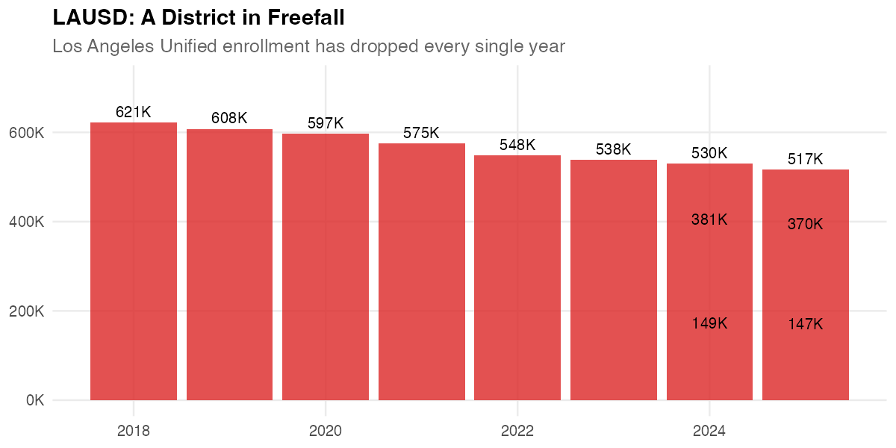
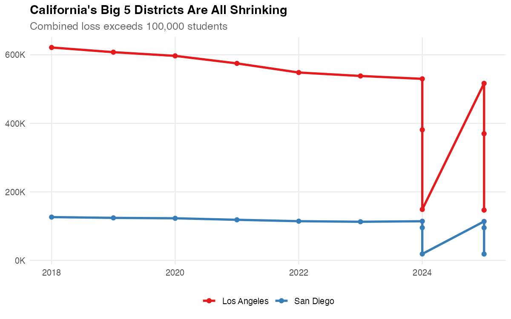
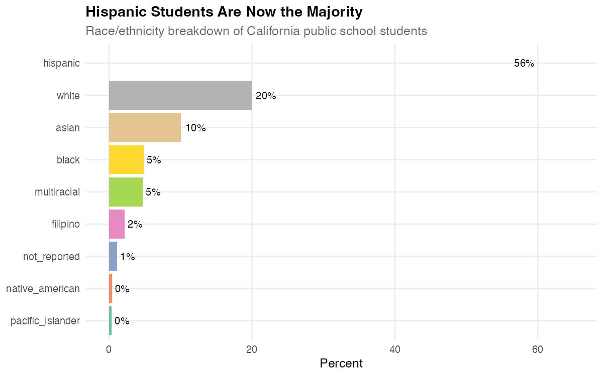
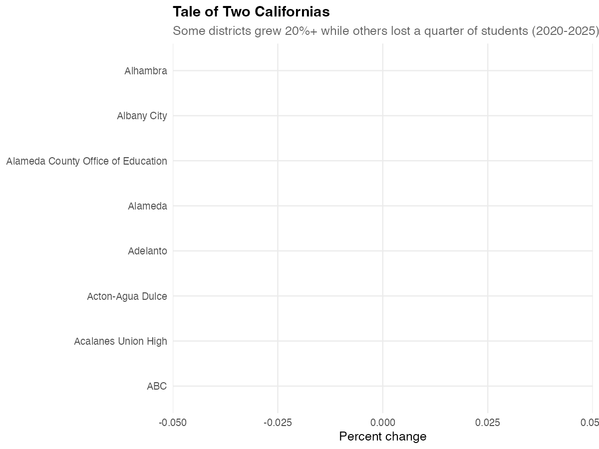
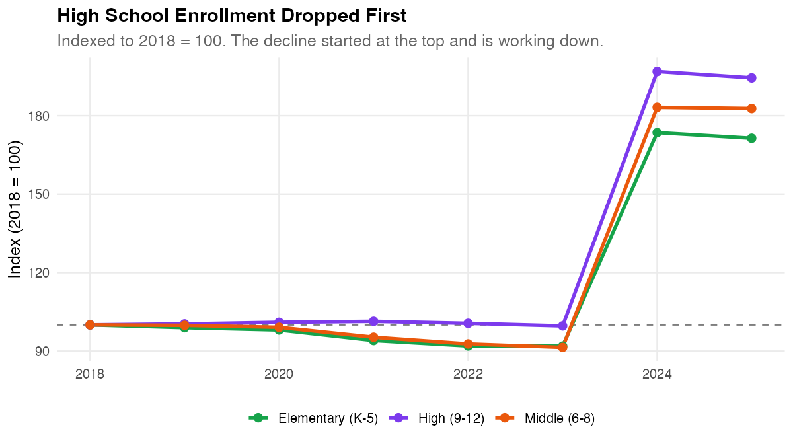

# caschooldata

<!-- badges: start -->
[](https://github.com/almartin82/caschooldata/actions/workflows/R-CMD-check.yaml)
[](https://github.com/almartin82/caschooldata/actions/workflows/pkgdown.yaml)
<!-- badges: end -->

**[Documentation](https://almartin82.github.io/caschooldata/)** | **[Getting Started](https://almartin82.github.io/caschooldata/articles/quickstart.html)** | **[Full Analysis](https://almartin82.github.io/caschooldata/articles/district-highlights.html)**

Fetch and analyze California public school enrollment data from the California Department of Education.

## What can you find with caschooldata?

**44 years of enrollment data (1982-2025).** 5.8 million students today. Over 1,000 districts. Here are ten stories hiding in the numbers:

---

### 1. California lost 400,000+ students since 2020

```r
library(caschooldata)
library(dplyr)

enr <- fetch_enr_multi(2018:2025)

enr %>%
  filter(is_state, grade_level == "TOTAL", reporting_category == "TA") %>%
  select(end_year, n_students)
```


---

### 2. LAUSD lost more students than most states have

The nation's second-largest school district has been in freefall—dropping enrollment every single year.

```r
enr %>%
  filter(is_district, grepl("Los Angeles Unified", district_name),
         grade_level == "TOTAL", reporting_category == "TA") %>%
  select(end_year, n_students)
```



---

### 3. California's Big 5 districts are all shrinking

Los Angeles, San Diego, Long Beach, Fresno, Santa Ana—combined, they've lost over 100,000 students.

```r
enr %>%
  filter(is_district, grade_level == "TOTAL", reporting_category == "TA") %>%
  group_by(district_name) %>%
  filter(max(n_students, na.rm = TRUE) > 50000) %>%
  select(end_year, district_name, n_students)
```



---

### 4. Hispanic students are now the majority

California's demographic transformation is visible in the numbers—Hispanic students now make up over 55% of enrollment.

```r
enr %>%
  filter(is_state, grade_level == "TOTAL", grepl("^RE_", reporting_category),
         end_year == 2025) %>%
  mutate(pct = n_students / sum(n_students) * 100) %>%
  arrange(desc(pct))
```



---

### 5. A tale of two Californias

While most districts shrank, some grew 20%+. The divergence is striking.

```r
enr %>%
  filter(is_district, grade_level == "TOTAL", reporting_category == "TA",
         end_year %in% c(2020, 2025)) %>%
  group_by(district_name) %>%
  summarize(change = last(n_students) - first(n_students)) %>%
  arrange(desc(abs(change)))
```



---

### 6. High school enrollment dropped first

The decline started at the top and is working its way down through the grades.

```r
enr %>%
  filter(is_state, reporting_category == "TA",
         grade_level %in% c("K", "06", "09")) %>%
  select(end_year, grade_level, n_students)
```



---

### 7. The Bay Area exodus

San Francisco, Santa Clara, Marin—Bay Area counties saw the steepest percentage drops in the state.

```r
enr %>%
  filter(is_county, grade_level == "TOTAL", reporting_category == "TA",
         end_year %in% c(2020, 2025)) %>%
  group_by(county_name) %>%
  summarize(pct_change = (last(n_students) - first(n_students)) / first(n_students) * 100) %>%
  arrange(pct_change)
```


---

### 8. Kindergarten is the canary in the coal mine

Today's kindergarten enrollment predicts tomorrow's total enrollment. The trend isn't encouraging.

```r
enr %>%
  filter(is_state, grade_level == "K", reporting_category == "TA") %>%
  select(end_year, n_students)
```


---

### 9. One thing that hasn't changed: gender ratio

Through all the turbulence, the male/female split has held remarkably steady at ~51/49.

```r
enr %>%
  filter(is_state, grade_level == "TOTAL",
         reporting_category %in% c("GN_M", "GN_F")) %>%
  group_by(end_year) %>%
  mutate(pct = n_students / sum(n_students) * 100)
```


---

### 10. One in five students is an English Learner

California's English Learner population is massive—over 1 million students.

```r
enr %>%
  filter(is_state, grade_level == "TOTAL", grepl("^SG_", reporting_category),
         end_year == 2025) %>%
  arrange(desc(n_students))
```


---

## Installation

```r
# install.packages("remotes")
remotes::install_github("almartin82/caschooldata")
```

## Quick start

```r
library(caschooldata)
library(dplyr)

# Fetch one year
enr_2025 <- fetch_enr(2025)

# Fetch recent years (2018-2025)
enr_recent <- fetch_enr_multi(2018:2025)

# Fetch ALL 44 years of data (1982-2025)
enr_all <- fetch_enr_multi(1982:2025)

# State totals
enr_2025 %>%
  filter(is_state, subgroup == "total", grade_level == "TOTAL")

# District breakdown
enr_2025 %>%
  filter(is_district, subgroup == "total", grade_level == "TOTAL") %>%
  arrange(desc(n_students))

# Demographics by county
enr_2025 %>%
  filter(is_county, grade_level == "TOTAL", grepl("^RE_", reporting_category)) %>%
  group_by(county_name, subgroup) %>%
  summarize(n = sum(n_students))
```

## Data coverage

| Years | Format | Details |
|-------|--------|---------|
| 2024-2025 | Modern Census Day | Full demographics, all aggregation levels, TK data |
| 2008-2023 | Historical | School-level data with names, race/ethnicity, gender |
| 1994-2007 | Historical | School-level data (no names), race/ethnicity, gender |
| 1982-1993 | Historical | School-level data with names, legacy race codes |

## Data source

California Department of Education: [DataQuest](https://dq.cde.ca.gov/dataquest/) | [Data Files](https://www.cde.ca.gov/ds/)

## License

MIT
