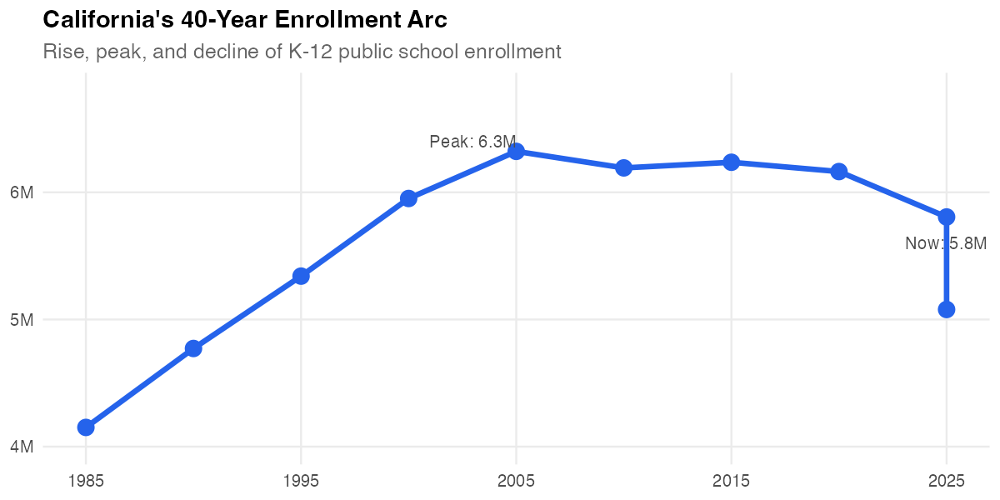
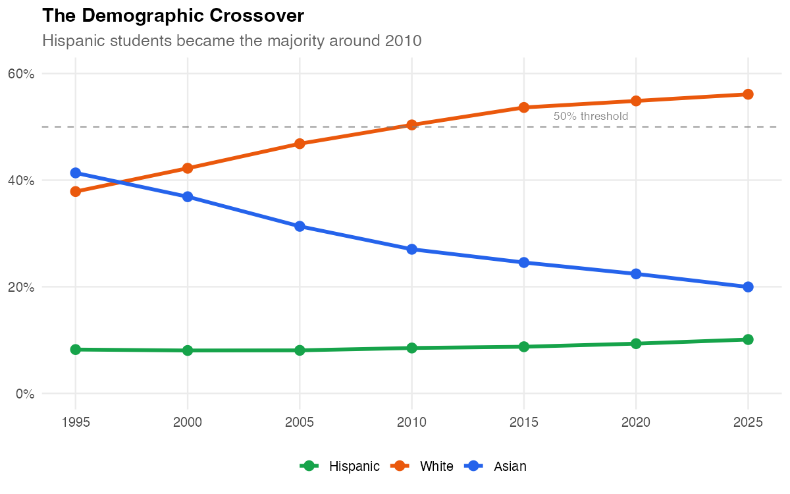
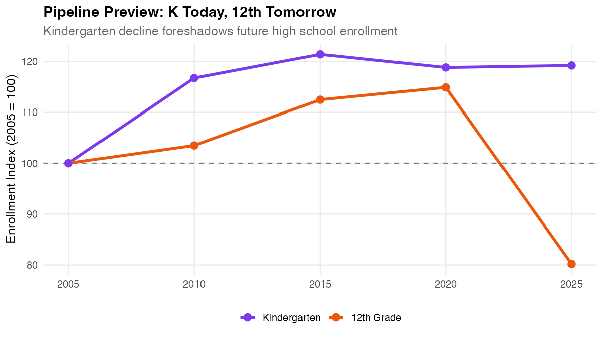
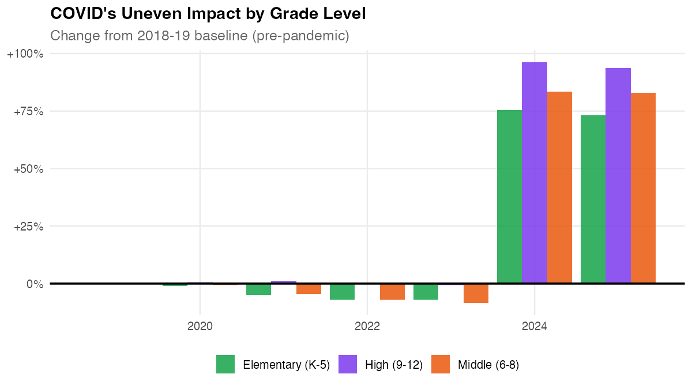
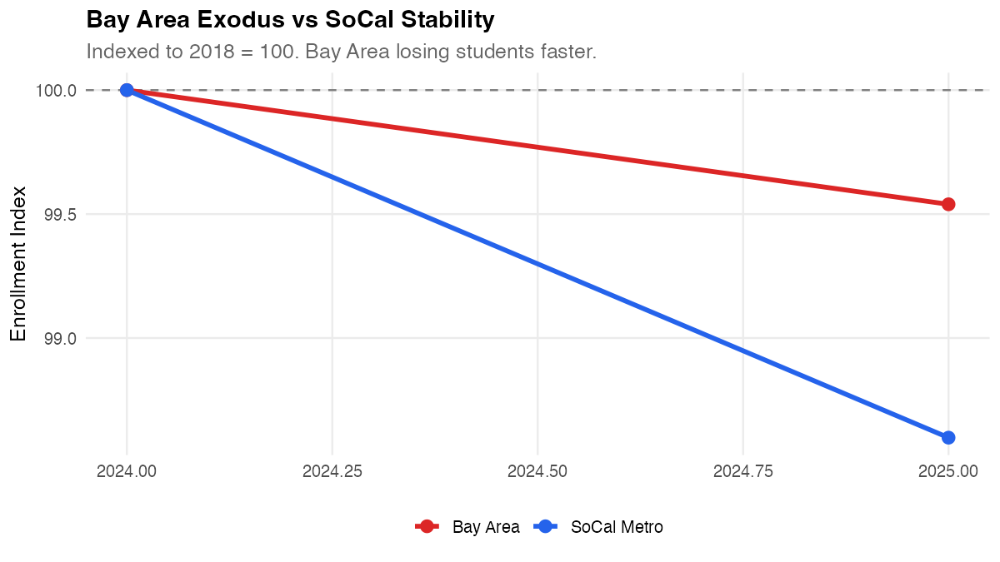
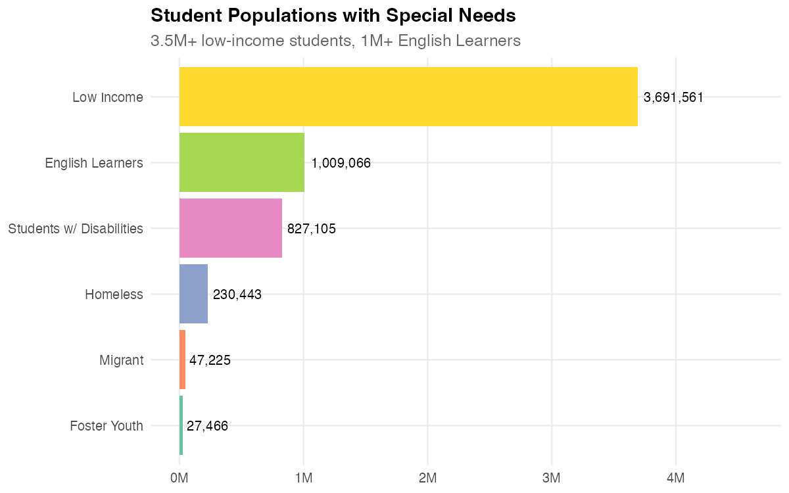
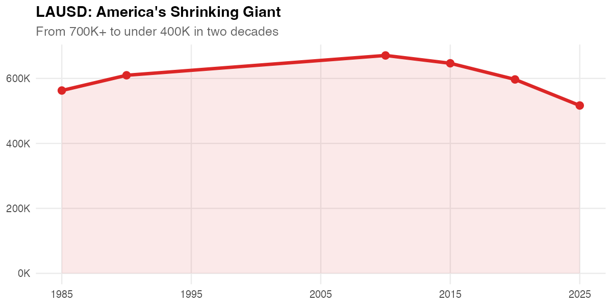
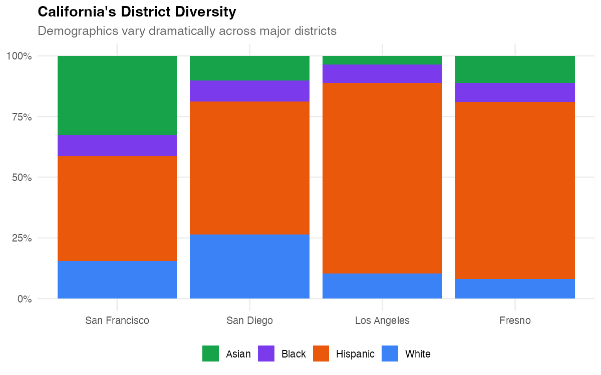

# caschooldata

<!-- badges: start -->
[](https://github.com/almartin82/caschooldata/actions/workflows/R-CMD-check.yaml)
[](https://github.com/almartin82/caschooldata/actions/workflows/pkgdown.yaml)
<!-- badges: end -->

**[Documentation](https://almartin82.github.io/caschooldata/)** | **[Getting Started](https://almartin82.github.io/caschooldata/articles/quickstart.html)** | **[Full Analysis](https://almartin82.github.io/caschooldata/articles/district-highlights.html)**

Fetch and analyze California public school enrollment data from the California Department of Education.

## What can you find with caschooldata?

**44 years of enrollment data (1982-2025).** 5.8 million students today. Over 1,000 districts. Here are ten stories hiding in the numbers:

---

### 1. The 40-year arc: rise, peak, and decline

California's K-12 enrollment peaked around 2003-04 at 6.3 million students. Today it's under 5.8 million.

```r
library(caschooldata)
library(dplyr)

enr <- fetch_enr_multi(c(1985, 1995, 2005, 2015, 2025))

enr %>%
  filter(is_state, grade_level == "TOTAL", reporting_category == "TA") %>%
  select(end_year, n_students)
```



---

### 2. The demographic crossover

Around 2010, Hispanic students became the majority. Today they're over 55% of enrollment.

```r
enr <- fetch_enr_multi(c(1995, 2000, 2005, 2010, 2015, 2020, 2025))

enr %>%
  filter(is_state, grade_level == "TOTAL", grepl("^RE_", reporting_category)) %>%
  group_by(end_year, subgroup) %>%
  summarize(n = sum(n_students)) %>%
  group_by(end_year) %>%
  mutate(pct = n / sum(n) * 100)
```



---

### 3. Kindergarten predicts the future

Today's kindergarten enrollment is tomorrow's high school enrollment. The K decline started before COVID.

```r
enr <- fetch_enr_multi(c(2005, 2010, 2015, 2020, 2025))

enr %>%
  filter(is_state, reporting_category == "TA", grade_level %in% c("K", "12")) %>%
  select(end_year, grade_level, n_students)
```



---

### 4. COVID hit elementary hardest

The pandemic's enrollment impact varied dramatically by grade level.

```r
enr <- fetch_enr_multi(2019:2025)

enr %>%
  filter(is_state, reporting_category == "TA",
         grade_level %in% c("K", "06", "09")) %>%
  select(end_year, grade_level, n_students)
```



---

### 5. LAUSD is America's second-largest district

California has 5 of the nation's 20 largest school districts.

```r
enr <- fetch_enr_multi(2018:2025)

# Filter for charter_status == "ALL" to avoid double-counting
# (modern Census Day files have separate rows for charter/non-charter)
enr %>%
  filter(is_district, grade_level == "TOTAL", reporting_category == "TA",
         charter_status %in% c("ALL", "All") | is.na(charter_status)) %>%
  group_by(district_name) %>%
  filter(max(n_students) > 50000) %>%
  select(end_year, district_name, n_students)
```


---

### 6. Bay Area districts are shrinking fastest

Urban districts in the Bay Area are losing students faster than their SoCal counterparts.

```r
enr %>%
  filter(is_district, grade_level == "TOTAL", reporting_category == "TA",
         district_name %in% c("San Francisco Unified", "Los Angeles Unified",
                              "Oakland Unified", "San Diego Unified")) %>%
  group_by(district_name) %>%
  mutate(index = n_students / first(n_students) * 100)
```



---

### 7. Gender balance holds steady

The ~51/49 male/female split remains consistent across all grade levels.

```r
enr_2025 <- fetch_enr(2025)

enr_2025 %>%
  filter(is_state, reporting_category %in% c("GN_M", "GN_F"),
         grade_level %in% c("K", "06", "12")) %>%
  group_by(grade_level) %>%
  mutate(pct = n_students / sum(n_students) * 100)
```


---

### 8. One in five students needs extra support

3.5 million low-income students. 1 million+ English Learners. Student groups data available from 2024+.

```r
enr_2025 %>%
  filter(is_state, grade_level == "TOTAL", grepl("^SG_", reporting_category)) %>%
  select(subgroup, n_students) %>%
  arrange(desc(n_students))
```



---

### 9. LAUSD: America's shrinking giant

The nation's second-largest district has lost nearly half its enrollment since its peak.

```r
enr <- fetch_enr_multi(c(1990, 2000, 2010, 2020, 2025))

enr %>%
  filter(is_district, grepl("Los Angeles Unified", district_name),
         grade_level == "TOTAL", reporting_category == "TA") %>%
  select(end_year, district_name, n_students)
```



---

### 10. California's district diversity

Demographics vary dramatically across major districts: majority Hispanic in LA and Fresno, highly diverse in SF and San Diego.

```r
enr_2025 %>%
  filter(is_district, grade_level == "TOTAL", grepl("^RE_", reporting_category)) %>%
  filter(district_name %in% c("San Francisco Unified", "Los Angeles Unified",
                               "Fresno Unified", "San Diego Unified")) %>%
  group_by(district_name, subgroup) %>%
  summarize(n = sum(n_students)) %>%
  group_by(district_name) %>%
  mutate(pct = n / sum(n) * 100)
```



---

## Installation

```r
# install.packages("remotes")
remotes::install_github("almartin82/caschooldata")
```

## Quick start

```r
library(caschooldata)
library(dplyr)

# Fetch one year
enr_2025 <- fetch_enr(2025)

# Fetch recent years (2018-2025)
enr_recent <- fetch_enr_multi(2018:2025)

# Fetch ALL 44 years of data (1982-2025)
enr_all <- fetch_enr_multi(1982:2025)

# State totals
enr_2025 %>%
  filter(is_state, subgroup == "total", grade_level == "TOTAL")

# District breakdown
enr_2025 %>%
  filter(is_district, subgroup == "total", grade_level == "TOTAL") %>%
  arrange(desc(n_students))

# Demographics by district
enr_2025 %>%
  filter(is_district, grade_level == "TOTAL", grepl("^RE_", reporting_category)) %>%
  group_by(district_name, subgroup) %>%
  summarize(n = sum(n_students))
```

## Data availability

| Years | Source | Aggregation Levels | Demographics | Notes |
|-------|--------|-------------------|--------------|-------|
| **2024-2025** | Census Day files | State, County, District, School | Race, Gender, Student Groups (EL, FRPM, SWD, etc.) | Full detail, TK included |
| **2008-2023** | Historical files | School (aggregates computed) | Race, Gender | Entity names included |
| **1994-2007** | Historical files | School (aggregates computed) | Race, Gender | No entity names (CDS codes only) |
| **1982-1993** | Historical files | School (aggregates computed) | Race, Gender | Letter-based race codes (mapped) |

### What's available by year range

- **Subgroups**: Race/ethnicity and gender available for all years. Student groups (English Learners, FRPM, Special Ed) only available 2024+.
- **Grade levels**: K-12 available for all years. Transitional Kindergarten (TK) only available 2024+.
- **Aggregation**: Modern files (2024+) include pre-computed state/county/district totals. Historical files only have school-level data; this package computes aggregates automatically.
- **Entity names**: School/district names available 2008+ and 1982-1993. Not available for 1994-2007 (use CDS code lookups).

## Data source

California Department of Education: [DataQuest](https://dq.cde.ca.gov/dataquest/) | [Data Files](https://www.cde.ca.gov/ds/)

## Part of the 50 State Schooldata Family

This package is part of a family of R packages providing school enrollment data for all 50 US states. Each package fetches data directly from the state's Department of Education.

**See also:** [njschooldata](https://github.com/almartin82/njschooldata) - The original state schooldata package for New Jersey.

**All packages:** [github.com/almartin82](https://github.com/almartin82?tab=repositories&q=schooldata)

## Author

[Andy Martin](https://github.com/almartin82) (almartin@gmail.com)

## License

MIT
