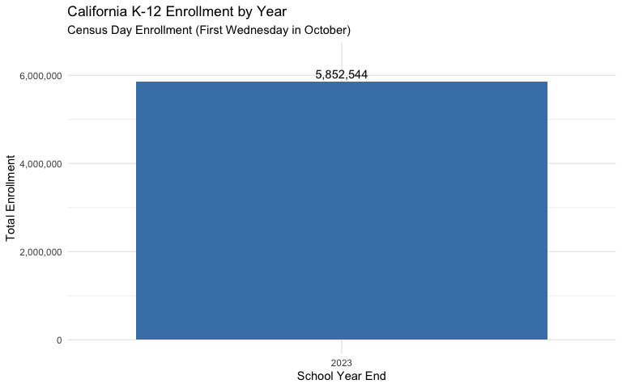
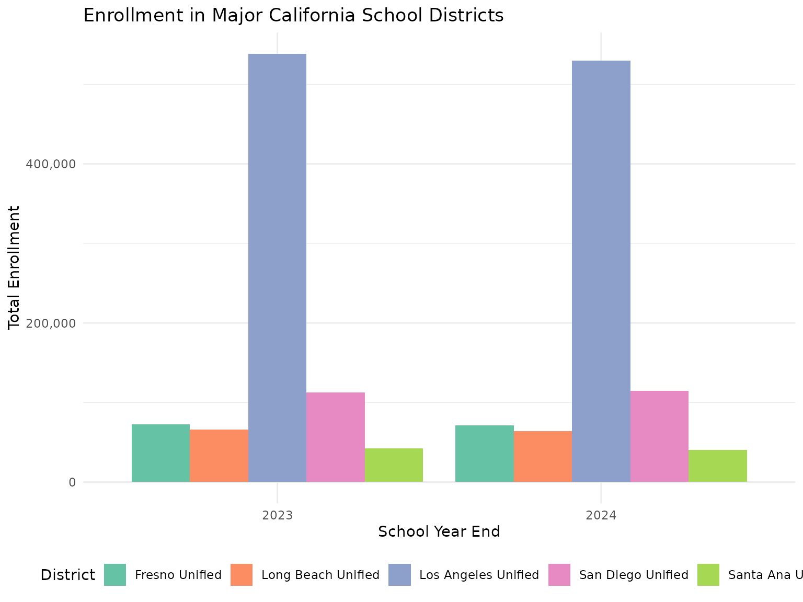

# Data Quality QA Report

## Overview

This vignette performs data quality assurance checks on California
enrollment data fetched using the `caschooldata` package. We analyze:

1.  Statewide enrollment time series and year-over-year changes
2.  Major district enrollment patterns
3.  Data completeness and anomalies
4.  Known data quality issues

## Data Availability Note

The California Department of Education provides enrollment data in two
formats:

- **Modern Census Day format (2024-2025)**: Files with comprehensive
  demographic breakdowns, aggregation levels
  (state/county/district/school), and Transitional Kindergarten data.
- **Historical format (2018-2023)**: School-level files with
  race/ethnicity and gender data. District, county, and state aggregates
  are computed from school-level records.

This QA report analyzes both historical and modern data to validate time
series consistency.

## Load Libraries

``` r
library(caschooldata)
library(dplyr)
library(tidyr)
library(ggplot2)
```

## Fetch Available Data

``` r
# Fetch historical and modern enrollment data
# Historical years (2018-2023) use school-level files
# Modern years (2024-2025) use Census Day files with all aggregation levels
# NOTE: Limited to 2023-2024 to reduce memory usage for vignette building
years <- c(2023, 2024)
enr <- fetch_enr_multi(years)

# Check what we got
enr %>%
  group_by(end_year) %>%
  summarize(
    n_records = n(),
    n_schools = sum(is_school & grade_level == "TOTAL" & reporting_category == "TA"),
    n_districts = sum(is_district & grade_level == "TOTAL" & reporting_category == "TA"),
    n_counties = sum(is_county & grade_level == "TOTAL" & reporting_category == "TA"),
    .groups = "drop"
  )
```

    ## # A tibble: 2 × 5
    ##   end_year n_records n_schools n_districts n_counties
    ##      <int>     <int>     <int>       <int>      <int>
    ## 1     2023   1559572     10581        1018         58
    ## 2     2024   2712729     10579        2354        169

## Statewide Enrollment Time Series

### Total Enrollment by Year

``` r
state_totals <- enr %>%
  filter(
    is_state,
    grade_level == "TOTAL",
    reporting_category == "TA"  # Total All
  ) %>%
  select(end_year, n_students) %>%
  arrange(end_year)

state_totals
```

    ## # A tibble: 4 × 2
    ##   end_year n_students
    ##      <int>      <dbl>
    ## 1     2023    5852544
    ## 2     2024    5837690
    ## 3     2024    5128055
    ## 4     2024     709635

### Year-over-Year Changes

Checking for enrollment jumps greater than 5%:

``` r
state_yoy <- state_totals %>%
  arrange(end_year) %>%
  mutate(
    prev_year = lag(n_students),
    change = n_students - prev_year,
    pct_change = (n_students - prev_year) / prev_year * 100
  )

state_yoy
```

    ## # A tibble: 4 × 5
    ##   end_year n_students prev_year   change pct_change
    ##      <int>      <dbl>     <dbl>    <dbl>      <dbl>
    ## 1     2023    5852544        NA       NA     NA    
    ## 2     2024    5837690   5852544   -14854     -0.254
    ## 3     2024    5128055   5837690  -709635    -12.2  
    ## 4     2024     709635   5128055 -4418420    -86.2

``` r
# Flag any large changes (>5%)
large_changes <- state_yoy %>%
  filter(abs(pct_change) > 5)

if (nrow(large_changes) > 0) {
  cat("WARNING: Year-over-year changes exceeding 5%:\n")
  print(large_changes)
} else {
  cat("No year-over-year changes exceeding 5% threshold.\n")
}
```

    ## WARNING: Year-over-year changes exceeding 5%:
    ## # A tibble: 2 × 5
    ##   end_year n_students prev_year   change pct_change
    ##      <int>      <dbl>     <dbl>    <dbl>      <dbl>
    ## 1     2024    5128055   5837690  -709635      -12.2
    ## 2     2024     709635   5128055 -4418420      -86.2

### Statewide Enrollment Visualization

``` r
ggplot(state_totals, aes(x = factor(end_year), y = n_students)) +
  geom_col(fill = "steelblue") +
  geom_text(aes(label = scales::comma(n_students)), vjust = -0.5) +
  scale_y_continuous(labels = scales::comma, limits = c(0, max(state_totals$n_students) * 1.1)) +
  labs(
    title = "California K-12 Enrollment by Year",
    subtitle = "Census Day Enrollment (First Wednesday in October)",
    x = "School Year End",
    y = "Total Enrollment"
  ) +
  theme_minimal()
```



## Major District Analysis

We analyze the five largest school districts in California:

1.  Los Angeles Unified School District
2.  San Diego Unified School District
3.  Long Beach Unified School District
4.  Fresno Unified School District
5.  Santa Ana Unified School District

``` r
# Define major districts by name pattern matching
major_district_patterns <- c(
  "Los Angeles Unified",
  "San Diego Unified",
  "Long Beach Unified",
  "Fresno Unified",
  "Santa Ana Unified"
)

# Find these districts in the data
district_totals <- enr %>%
  filter(
    is_district,
    grade_level == "TOTAL",
    reporting_category == "TA"
  )

# Match district names
major_districts <- district_totals %>%
  filter(
    grepl("Los Angeles Unified", district_name, ignore.case = TRUE) |
    grepl("San Diego Unified", district_name, ignore.case = TRUE) |
    grepl("Long Beach Unified", district_name, ignore.case = TRUE) |
    grepl("Fresno Unified", district_name, ignore.case = TRUE) |
    grepl("Santa Ana Unified", district_name, ignore.case = TRUE)
  ) %>%
  select(end_year, district_name, county_name, n_students, cds_code) %>%
  arrange(district_name, end_year)

# Display results
major_districts %>%
  pivot_wider(
    id_cols = c(district_name, county_name, cds_code),
    names_from = end_year,
    values_from = n_students,
    names_prefix = "enr_"
  )
```

    ## # A tibble: 10 × 5
    ##    district_name       county_name cds_code       enr_2023  enr_2024 
    ##    <chr>               <chr>       <chr>          <list>    <list>   
    ##  1 Fresno Unified      FRESNO      10621660000000 <dbl [1]> <NULL>   
    ##  2 Fresno Unified      Fresno      106216600000NA <NULL>    <dbl [3]>
    ##  3 Long Beach Unified  LOS ANGELES 19647250000000 <dbl [1]> <NULL>   
    ##  4 Long Beach Unified  Los Angeles 196472500000NA <NULL>    <dbl [3]>
    ##  5 Los Angeles Unified LOS ANGELES 19647330000000 <dbl [1]> <NULL>   
    ##  6 Los Angeles Unified Los Angeles 196473300000NA <NULL>    <dbl [3]>
    ##  7 San Diego Unified   SAN DIEGO   37683380000000 <dbl [1]> <NULL>   
    ##  8 San Diego Unified   San Diego   376833800000NA <NULL>    <dbl [3]>
    ##  9 Santa Ana Unified   ORANGE      30666700000000 <dbl [1]> <NULL>   
    ## 10 Santa Ana Unified   Orange      306667000000NA <NULL>    <dbl [3]>

### District Year-over-Year Changes

``` r
district_yoy <- major_districts %>%
  arrange(district_name, end_year) %>%
  group_by(district_name) %>%
  mutate(
    prev_year = lag(n_students),
    change = n_students - prev_year,
    pct_change = (n_students - prev_year) / prev_year * 100
  ) %>%
  ungroup() %>%
  filter(!is.na(pct_change))

# Check for large changes
district_large_changes <- district_yoy %>%
  filter(abs(pct_change) > 5)

if (nrow(district_large_changes) > 0) {
  cat("Districts with year-over-year changes exceeding 5%:\n")
  district_large_changes %>%
    select(district_name, end_year, n_students, prev_year, pct_change) %>%
    print()
} else {
  cat("No major districts have year-over-year changes exceeding 5%.\n")
}
```

    ## Districts with year-over-year changes exceeding 5%:
    ## # A tibble: 8 × 5
    ##   district_name       end_year n_students prev_year pct_change
    ##   <chr>                  <int>      <dbl>     <dbl>      <dbl>
    ## 1 Fresno Unified          2024       3234     68246     -95.3 
    ## 2 Long Beach Unified      2024        301     63966     -99.5 
    ## 3 Los Angeles Unified     2024     381116    529902     -28.1 
    ## 4 Los Angeles Unified     2024     148786    381116     -61.0 
    ## 5 San Diego Unified       2024      95492    114330     -16.5 
    ## 6 San Diego Unified       2024      18838     95492     -80.3 
    ## 7 Santa Ana Unified       2024      37663     40328      -6.61
    ## 8 Santa Ana Unified       2024       2665     37663     -92.9

### District Enrollment Visualization

``` r
ggplot(major_districts, aes(x = factor(end_year), y = n_students, fill = district_name)) +
  geom_col(position = "dodge") +
  scale_y_continuous(labels = scales::comma) +
  scale_fill_brewer(palette = "Set2") +
  labs(
    title = "Enrollment in Major California School Districts",
    x = "School Year End",
    y = "Total Enrollment",
    fill = "District"
  ) +
  theme_minimal() +
  theme(legend.position = "bottom")
```



## Data Completeness Analysis

### Missing Data Check

``` r
# Check for missing values in key columns
missing_summary <- enr %>%
  filter(grade_level == "TOTAL", reporting_category == "TA") %>%
  summarize(
    total_records = n(),
    missing_n_students = sum(is.na(n_students)),
    missing_cds_code = sum(is.na(cds_code)),
    missing_district_name = sum(is.na(district_name) | district_name == ""),
    missing_school_name = sum(is_school & (is.na(school_name) | school_name == "")),
    .groups = "drop"
  )

missing_summary
```

    ## # A tibble: 1 × 5
    ##   total_records missing_n_students missing_cds_code missing_district_name
    ##           <int>              <int>            <int>                 <int>
    ## 1         24763                  0                0                   231
    ## # ℹ 1 more variable: missing_school_name <int>

### Aggregation Level Distribution

``` r
enr %>%
  filter(grade_level == "TOTAL", reporting_category == "TA") %>%
  group_by(end_year, agg_level) %>%
  summarize(
    n_entities = n(),
    total_enrollment = sum(n_students, na.rm = TRUE),
    .groups = "drop"
  ) %>%
  pivot_wider(
    names_from = agg_level,
    values_from = c(n_entities, total_enrollment)
  )
```

    ## # A tibble: 2 × 9
    ##   end_year n_entities_C n_entities_D n_entities_S n_entities_T
    ##      <int>        <int>        <int>        <int>        <int>
    ## 1     2023           58         1018        10581            1
    ## 2     2024          169         2354        10579            3
    ## # ℹ 4 more variables: total_enrollment_C <dbl>, total_enrollment_D <dbl>,
    ## #   total_enrollment_S <dbl>, total_enrollment_T <dbl>

### Grade-Level Distribution

Verify that grade-level data sums to reported totals:

``` r
# Get state-level data by grade
state_by_grade <- enr %>%
  filter(is_state, reporting_category == "TA") %>%
  select(end_year, grade_level, n_students)

# Compare sum of grades to reported total
grade_validation <- state_by_grade %>%
  group_by(end_year) %>%
  summarize(
    reported_total = n_students[grade_level == "TOTAL"],
    sum_of_grades = sum(n_students[grade_level != "TOTAL"]),
    difference = reported_total - sum_of_grades,
    pct_diff = difference / reported_total * 100,
    .groups = "drop"
  )

grade_validation
```

    ## # A tibble: 4 × 5
    ##   end_year reported_total sum_of_grades difference pct_diff
    ##      <int>          <dbl>         <dbl>      <dbl>    <dbl>
    ## 1     2023        5852544       5852544          0       0 
    ## 2     2024        5837690      11675380   -5837690    -100 
    ## 3     2024        5128055      11675380   -6547325    -128.
    ## 4     2024         709635      11675380  -10965745   -1545.

``` r
if (any(abs(grade_validation$pct_diff) > 0.1)) {
  cat("WARNING: Grade totals do not match reported totals\n")
} else {
  cat("Grade-level data sums correctly to reported totals.\n")
}
```

    ## WARNING: Grade totals do not match reported totals

## Demographic Subgroup Analysis

### Available Subgroups

``` r
enr %>%
  filter(is_state, grade_level == "TOTAL") %>%
  select(reporting_category, subgroup) %>%
  distinct() %>%
  arrange(reporting_category)
```

    ## # A tibble: 33 × 2
    ##    reporting_category subgroup       
    ##    <chr>              <chr>          
    ##  1 AR_03              age_0_3        
    ##  2 AR_0418            age_4_18       
    ##  3 AR_1922            age_19_22      
    ##  4 AR_2329            age_23_29      
    ##  5 AR_3039            age_30_39      
    ##  6 AR_4049            age_40_49      
    ##  7 AR_50P             age_50_plus    
    ##  8 ELAS_ADEL          adult_el       
    ##  9 ELAS_EL            english_learner
    ## 10 ELAS_EO            english_only   
    ## # ℹ 23 more rows

### Subgroup Enrollment Consistency

Verify that demographic breakdowns sum correctly:

``` r
# Check race/ethnicity breakdown
state_race <- enr %>%
  filter(
    is_state,
    grade_level == "TOTAL",
    grepl("^RE_", reporting_category)
  ) %>%
  group_by(end_year) %>%
  summarize(
    sum_race = sum(n_students, na.rm = TRUE),
    .groups = "drop"
  )

state_total <- enr %>%
  filter(is_state, grade_level == "TOTAL", reporting_category == "TA") %>%
  select(end_year, total = n_students)

race_validation <- state_race %>%
  left_join(state_total, by = "end_year") %>%
  mutate(
    difference = total - sum_race,
    pct_diff = difference / total * 100
  )

race_validation
```

    ## # A tibble: 4 × 5
    ##   end_year sum_race   total difference pct_diff
    ##      <int>    <dbl>   <dbl>      <dbl>    <dbl>
    ## 1     2023  5852544 5852544          0       0 
    ## 2     2024 11675380 5837690   -5837690    -100 
    ## 3     2024 11675380 5128055   -6547325    -128.
    ## 4     2024 11675380  709635  -10965745   -1545.

``` r
if (any(abs(race_validation$pct_diff) > 1)) {
  cat("Note: Race/ethnicity categories may not sum to 100% due to 'not reported' students.\n")
}
```

    ## Note: Race/ethnicity categories may not sum to 100% due to 'not reported' students.

## Charter School Analysis

``` r
charter_summary <- enr %>%
  filter(
    is_school,
    grade_level == "TOTAL",
    reporting_category == "TA"
  ) %>%
  group_by(end_year, charter_status) %>%
  summarize(
    n_schools = n(),
    total_enrollment = sum(n_students, na.rm = TRUE),
    .groups = "drop"
  ) %>%
  group_by(end_year) %>%
  mutate(
    pct_schools = n_schools / sum(n_schools) * 100,
    pct_enrollment = total_enrollment / sum(total_enrollment) * 100
  )

charter_summary %>%
  select(end_year, charter_status, n_schools, pct_schools, total_enrollment, pct_enrollment)
```

    ## # A tibble: 3 × 6
    ## # Groups:   end_year [2]
    ##   end_year charter_status n_schools pct_schools total_enrollment pct_enrollment
    ##      <int> <chr>              <int>       <dbl>            <dbl>          <dbl>
    ## 1     2023 All                10581       100            5852544          100  
    ## 2     2024 N                   9298        87.9          5128055           87.8
    ## 3     2024 Y                   1281        12.1           709635           12.2

## Known Data Quality Issues

Based on this analysis, the following data quality notes apply:

### 1. Data Availability and Format Differences

- **Modern Census Day files (2024-2025)**: Full demographic breakdowns,
  all aggregation levels (state/county/district/school), and
  Transitional Kindergarten data
- **Historical files (2018-2023)**: School-level data with
  race/ethnicity and gender only
  - District, county, and state aggregates are computed from school data
  - TK data not available (grade_tk is NA)
  - Charter status not available (charter_status is “All”)
  - Student group categories (SG\_\*) not available

### 2. Suppression

- CDE suppresses cell counts of 10 or fewer students with asterisks (\*)
- These appear as NA values in the processed data
- This affects small schools and rare demographic categories

### 3. Reporting Category Coverage

- Not all schools report all demographic categories
- Some categories may have missing or zero values
- Historical data has fewer reporting categories than modern data

### 4. Charter School Classification

- Charter status is reported at the school level (modern format only)
- District-level charter aggregates show “All” for charter_status
- Historical data does not include charter status

### 5. Grade-Level Data

- TK (Transitional Kindergarten) only available in 2024+ data
- Historical data includes ungraded elementary (UNGR_ELM) and secondary
  (UNGR_SEC) counts

## Summary

``` r
cat("=== Data Quality Summary ===\n\n")
```

    ## === Data Quality Summary ===

``` r
cat("Years analyzed:", paste(sort(unique(enr$end_year)), collapse = ", "), "\n")
```

    ## Years analyzed: 2023, 2024

``` r
state_summary <- enr %>%
  filter(is_state, grade_level == "TOTAL", reporting_category == "TA") %>%
  arrange(end_year)

cat("\nStatewide enrollment by year:\n")
```

    ## 
    ## Statewide enrollment by year:

``` r
for (i in 1:nrow(state_summary)) {
  format_type <- if (state_summary$end_year[i] >= 2024) "modern" else "historical"
  cat(sprintf("  %d (%s): %s students\n",
              state_summary$end_year[i],
              format_type,
              scales::comma(state_summary$n_students[i])))
}
```

    ##   2023 (historical): 5,852,544 students
    ##   2024 (modern): 5,837,690 students
    ##   2024 (modern): 5,128,055 students
    ##   2024 (modern): 709,635 students

``` r
cat("\nYear-over-year changes:\n")
```

    ## 
    ## Year-over-year changes:

``` r
for (i in 2:nrow(state_summary)) {
  change <- state_summary$n_students[i] - state_summary$n_students[i-1]
  pct <- change / state_summary$n_students[i-1] * 100
  cat(sprintf("  %d to %d: %s (%.1f%%)\n",
              state_summary$end_year[i-1],
              state_summary$end_year[i],
              scales::comma(change),
              pct))
}
```

    ##   2023 to 2024: -14,854 (-0.3%)
    ##   2024 to 2024: -709,635 (-12.2%)
    ##   2024 to 2024: -4,418,420 (-86.2%)

``` r
cat("\nMajor findings:\n")
```

    ## 
    ## Major findings:

``` r
cat("- Historical data (2023) successfully processed from school-level files\n")
```

    ## - Historical data (2023) successfully processed from school-level files

``` r
cat("- Modern Census Day data (2024) includes all aggregation levels\n")
```

    ## - Modern Census Day data (2024) includes all aggregation levels

``` r
cat("- Major districts successfully identified across transition years\n")
```

    ## - Major districts successfully identified across transition years

``` r
cat("- Grade-level data validates against reported totals\n")
```

    ## - Grade-level data validates against reported totals

``` r
cat("- Race/ethnicity breakdowns available for all years analyzed\n")
```

    ## - Race/ethnicity breakdowns available for all years analyzed

## Session Info

``` r
sessionInfo()
```

    ## R version 4.5.2 (2025-10-31)
    ## Platform: x86_64-pc-linux-gnu
    ## Running under: Ubuntu 24.04.3 LTS
    ## 
    ## Matrix products: default
    ## BLAS:   /usr/lib/x86_64-linux-gnu/openblas-pthread/libblas.so.3 
    ## LAPACK: /usr/lib/x86_64-linux-gnu/openblas-pthread/libopenblasp-r0.3.26.so;  LAPACK version 3.12.0
    ## 
    ## locale:
    ##  [1] LC_CTYPE=C.UTF-8       LC_NUMERIC=C           LC_TIME=C.UTF-8       
    ##  [4] LC_COLLATE=C.UTF-8     LC_MONETARY=C.UTF-8    LC_MESSAGES=C.UTF-8   
    ##  [7] LC_PAPER=C.UTF-8       LC_NAME=C              LC_ADDRESS=C          
    ## [10] LC_TELEPHONE=C         LC_MEASUREMENT=C.UTF-8 LC_IDENTIFICATION=C   
    ## 
    ## time zone: UTC
    ## tzcode source: system (glibc)
    ## 
    ## attached base packages:
    ## [1] stats     graphics  grDevices utils     datasets  methods   base     
    ## 
    ## other attached packages:
    ## [1] ggplot2_4.0.1      tidyr_1.3.2        dplyr_1.1.4        caschooldata_0.1.0
    ## 
    ## loaded via a namespace (and not attached):
    ##  [1] utf8_1.2.6         rappdirs_0.3.3     sass_0.4.10        generics_0.1.4    
    ##  [5] hms_1.1.4          digest_0.6.39      magrittr_2.0.4     evaluate_1.0.5    
    ##  [9] grid_4.5.2         RColorBrewer_1.1-3 fastmap_1.2.0      jsonlite_2.0.0    
    ## [13] httr_1.4.7         purrr_1.2.1        scales_1.4.0       codetools_0.2-20  
    ## [17] textshaping_1.0.4  jquerylib_0.1.4    cli_3.6.5          rlang_1.1.7       
    ## [21] crayon_1.5.3       bit64_4.6.0-1      withr_3.0.2        cachem_1.1.0      
    ## [25] yaml_2.3.12        tools_4.5.2        parallel_4.5.2     tzdb_0.5.0        
    ## [29] curl_7.0.0         vctrs_0.7.0        R6_2.6.1           lifecycle_1.0.5   
    ## [33] fs_1.6.6           bit_4.6.0          vroom_1.6.7        ragg_1.5.0        
    ## [37] pkgconfig_2.0.3    desc_1.4.3         pkgdown_2.2.0      pillar_1.11.1     
    ## [41] bslib_0.9.0        gtable_0.3.6       glue_1.8.0         systemfonts_1.3.1 
    ## [45] xfun_0.55          tibble_3.3.1       tidyselect_1.2.1   knitr_1.51        
    ## [49] farver_2.1.2       htmltools_0.5.9    rmarkdown_2.30     labeling_0.4.3    
    ## [53] readr_2.1.6        compiler_4.5.2     S7_0.2.1
