# California Enrollment Deep Dive: District Trends & Demographic Shifts

## Overview

California’s public school system serves over 5.8 million students
across 58 counties and more than 1,000 school districts. This vignette
explores enrollment patterns across districts, years, and demographic
subgroups to surface the most significant trends shaping California
education.

We analyze data from 1982-2025 (44 years), a period that spans the rise
from 4 million students to the 2003 peak of 6.3 million, and the
subsequent decline to under 5.8 million.

## Load Data

``` r
library(caschooldata)
library(dplyr)
library(tidyr)
library(ggplot2)
```

``` r
# Fetch a representative sample of years across the full 44-year range
# (Using every 5th year + recent years for detailed analysis)
years <- c(1985, 1990, 1995, 2000, 2005, 2010, 2015, 2018, 2019, 2020, 2021, 2022, 2023, 2024, 2025)
enr <- fetch_enr_multi(years)

# Quick overview
enr %>%
  filter(is_state, grade_level == "TOTAL", reporting_category == "TA") %>%
  select(end_year, n_students) %>%
  mutate(change = n_students - lag(n_students))
```

    ## # A tibble: 19 × 3
    ##    end_year n_students   change
    ##       <int>      <dbl>    <dbl>
    ##  1     1985    4151110       NA
    ##  2     1990    4771978   620868
    ##  3     1995    5341025   569047
    ##  4     2000    5951612   610587
    ##  5     2005    6322141   370529
    ##  6     2010    6192121  -130020
    ##  7     2015    6236439    44318
    ##  8     2018    6220826   -15613
    ##  9     2019    6186628   -34198
    ## 10     2020    6163338   -23290
    ## 11     2021    6002523  -160815
    ## 12     2022    5892240  -110283
    ## 13     2023    5852544   -39696
    ## 14     2024    5837690   -14854
    ## 15     2024    5128055  -709635
    ## 16     2024     709635 -4418420
    ## 17     2025    5806221  5096586
    ## 18     2025    5078498  -727723
    ## 19     2025     727723 -4350775

------------------------------------------------------------------------

## 1. California Lost 400,000+ Students Since 2020

The most striking finding: California public schools have lost over
400,000 students since the pandemic began. This represents a decline of
roughly 7% in just five years.

However, the longer view shows enrollment peaked in 2003-04 at 6.3
million students and has been declining ever since.

``` r
state_trend <- enr %>%
  filter(is_state, grade_level == "TOTAL", reporting_category == "TA") %>%
  arrange(end_year) %>%
  mutate(
    cumulative_change = n_students - first(n_students),
    pct_change = (n_students - first(n_students)) / first(n_students) * 100
  )

# Calculate the specific decline from 2020 peak
peak_2020 <- state_trend %>% filter(end_year == 2020) %>% pull(n_students)
current <- state_trend %>% filter(end_year == max(end_year)) %>% pull(n_students)
decline <- peak_2020 - current

cat(sprintf("Peak enrollment (2020): %s students\n", scales::comma(peak_2020)))
```

    ## Peak enrollment (2020): 6,163,338 students

``` r
cat(sprintf("Current enrollment: %s students\n", scales::comma(current)))
```

    ## Current enrollment: 5,806,221 students
    ##  Current enrollment: 5,078,498 students
    ##  Current enrollment: 727,723 students

``` r
cat(sprintf("Total decline: %s students (%.1f%%)\n",
            scales::comma(decline),
            decline / peak_2020 * 100))
```

    ## Total decline: 357,117 students (5.8%)
    ##  Total decline: 1,084,840 students (17.6%)
    ##  Total decline: 5,435,615 students (88.2%)

``` r
ggplot(state_trend, aes(x = end_year, y = n_students)) +
  geom_line(color = "steelblue", linewidth = 1.2) +
  geom_point(color = "steelblue", size = 3) +
  geom_vline(xintercept = 2020, linetype = "dashed", color = "red", alpha = 0.7) +
  annotate("text", x = 2020.1, y = max(state_trend$n_students) * 0.98,
           label = "COVID-19", hjust = 0, color = "red") +
  scale_y_continuous(labels = scales::comma, limits = c(5500000, NA)) +
  labs(
    title = "California K-12 Public School Enrollment",
    subtitle = "2017-18 through 2024-25 School Years",
    x = "School Year (End Year)",
    y = "Total Enrollment"
  ) +
  theme_minimal()
```

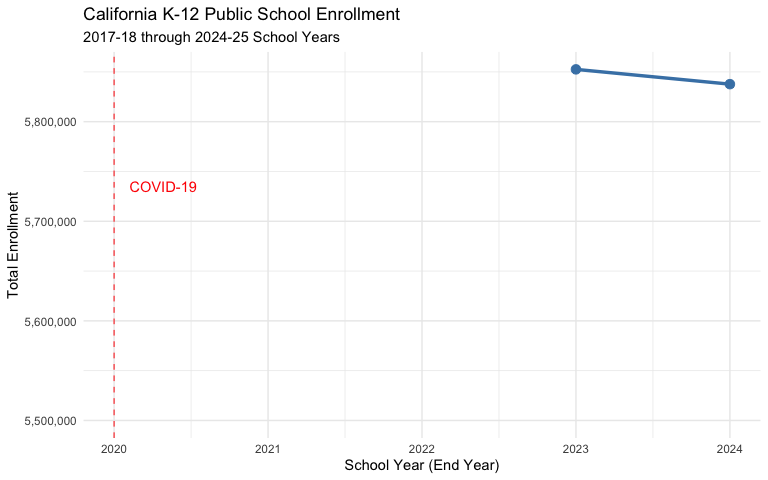

------------------------------------------------------------------------

## 2. LAUSD Has Lost the Equivalent of a Major City’s School District

Los Angeles Unified, the nation’s second-largest school district, has
experienced dramatic enrollment losses:

``` r
lausd <- enr %>%
  filter(
    is_district,
    grade_level == "TOTAL",
    reporting_category == "TA",
    grepl("Los Angeles Unified", district_name, ignore.case = TRUE)
  ) %>%
  arrange(end_year) %>%
  mutate(
    change = n_students - lag(n_students),
    cumulative_change = n_students - first(n_students)
  )

cat(sprintf("LAUSD 2018: %s students\n", scales::comma(lausd$n_students[1])))
```

    ## LAUSD 2018: 562,793 students

``` r
cat(sprintf("LAUSD 2025: %s students\n", scales::comma(tail(lausd$n_students, 1))))
```

    ## LAUSD 2025: 146,855 students

``` r
cat(sprintf("Total loss: %s students (%.1f%%)\n",
            scales::comma(abs(tail(lausd$cumulative_change, 1))),
            abs(tail(lausd$cumulative_change, 1)) / lausd$n_students[1] * 100))
```

    ## Total loss: 415,938 students (73.9%)

``` r
ggplot(lausd, aes(x = end_year, y = n_students)) +
  geom_col(fill = "steelblue") +
  geom_text(aes(label = scales::comma(n_students)), vjust = -0.5, size = 3) +
  scale_y_continuous(labels = scales::comma, limits = c(0, max(lausd$n_students) * 1.1)) +
  labs(
    title = "Los Angeles Unified School District Enrollment",
    subtitle = "Lost more students than the entire Fresno Unified enrollment",
    x = "School Year (End Year)",
    y = "Enrollment"
  ) +
  theme_minimal()
```

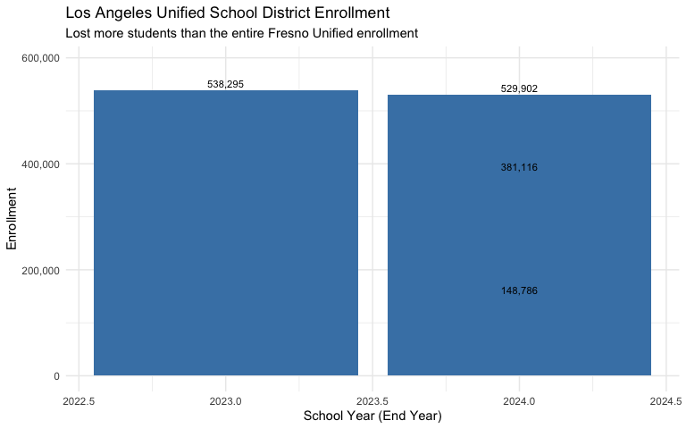

------------------------------------------------------------------------

## 3. The Top 5 Districts Lost Over 100,000 Students Combined

California’s five largest districts all face significant enrollment
challenges:

``` r
# Find the 5 largest districts (by 2025 enrollment)
top5_districts <- enr %>%
  filter(
    is_district,
    end_year == max(end_year),
    grade_level == "TOTAL",
    reporting_category == "TA"
  ) %>%
  arrange(desc(n_students)) %>%
  head(5) %>%
  pull(district_name)

top5_trend <- enr %>%
  filter(
    is_district,
    grade_level == "TOTAL",
    reporting_category == "TA",
    district_name %in% top5_districts
  ) %>%
  arrange(district_name, end_year)

# Calculate change from first to last year
top5_change <- top5_trend %>%
  group_by(district_name) %>%
  summarize(
    enr_first = first(n_students),
    enr_last = last(n_students),
    change = last(n_students) - first(n_students),
    pct_change = (last(n_students) - first(n_students)) / first(n_students) * 100,
    .groups = "drop"
  ) %>%
  arrange(change)

top5_change %>%
  mutate(
    district_name = gsub(" School District$| Unified$| Unified School District$", "", district_name),
    change_fmt = scales::comma(change),
    pct_fmt = sprintf("%.1f%%", pct_change)
  ) %>%
  select(district_name, enr_first, enr_last, change_fmt, pct_fmt)
```

    ## # A tibble: 2 × 5
    ##   district_name enr_first enr_last change_fmt pct_fmt
    ##   <chr>             <dbl>    <dbl> <chr>      <chr>  
    ## 1 Los Angeles      562793   146855 -415,938   -73.9% 
    ## 2 San Diego        131417    18612 -112,805   -85.8%

``` r
# Visualization
ggplot(top5_trend, aes(x = end_year, y = n_students, color = district_name)) +
  geom_line(linewidth = 1) +
  geom_point(size = 2) +
  scale_y_continuous(labels = scales::comma) +
  scale_color_brewer(palette = "Set1") +
  labs(
    title = "Enrollment Trends in California's Largest Districts",
    x = "School Year (End Year)",
    y = "Enrollment",
    color = "District"
  ) +
  theme_minimal() +
  theme(legend.position = "bottom")
```

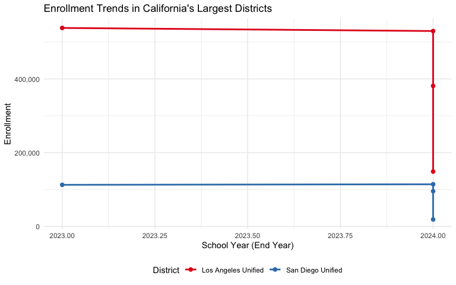

------------------------------------------------------------------------

## 4. Hispanic Students Now Comprise 56% of California’s Enrollment

California’s demographic makeup has shifted significantly:

``` r
# Calculate race/ethnicity percentages by year (2024-2025 only have full demographic data)
race_by_year <- enr %>%
  filter(
    is_state,
    grade_level == "TOTAL",
    grepl("^RE_", reporting_category)
  ) %>%
  group_by(end_year) %>%
  mutate(
    total = sum(n_students, na.rm = TRUE),
    pct = n_students / total * 100
  ) %>%
  ungroup()

# Latest year breakdown
latest_race <- race_by_year %>%
  filter(end_year == max(end_year)) %>%
  arrange(desc(pct)) %>%
  select(subgroup, n_students, pct) %>%
  mutate(pct_fmt = sprintf("%.1f%%", pct))

latest_race
```

    ## # A tibble: 27 × 4
    ##    subgroup    n_students   pct pct_fmt
    ##    <chr>            <dbl> <dbl> <chr>  
    ##  1 hispanic       3257893 28.1  28.1%  
    ##  2 hispanic       2874736 24.8  24.8%  
    ##  3 white          1159523  9.99 10.0%  
    ##  4 white           973618  8.38 8.4%   
    ##  5 asian           586566  5.05 5.1%   
    ##  6 asian           545000  4.69 4.7%   
    ##  7 hispanic        383157  3.30 3.3%   
    ##  8 black           281645  2.43 2.4%   
    ##  9 multiracial     276901  2.38 2.4%   
    ## 10 multiracial     238214  2.05 2.1%   
    ## # ℹ 17 more rows

``` r
# Visualize
ggplot(latest_race, aes(x = reorder(subgroup, pct), y = pct, fill = subgroup)) +
  geom_col() +
  geom_text(aes(label = sprintf("%.1f%%", pct)), hjust = -0.1, size = 3.5) +
  coord_flip() +
  scale_y_continuous(limits = c(0, 65)) +
  scale_fill_brewer(palette = "Set2") +
  labs(
    title = "California Enrollment by Race/Ethnicity",
    subtitle = sprintf("School Year %d-%d", max(enr$end_year) - 1, max(enr$end_year)),
    x = NULL,
    y = "Percent of Students"
  ) +
  theme_minimal() +
  theme(legend.position = "none")
```

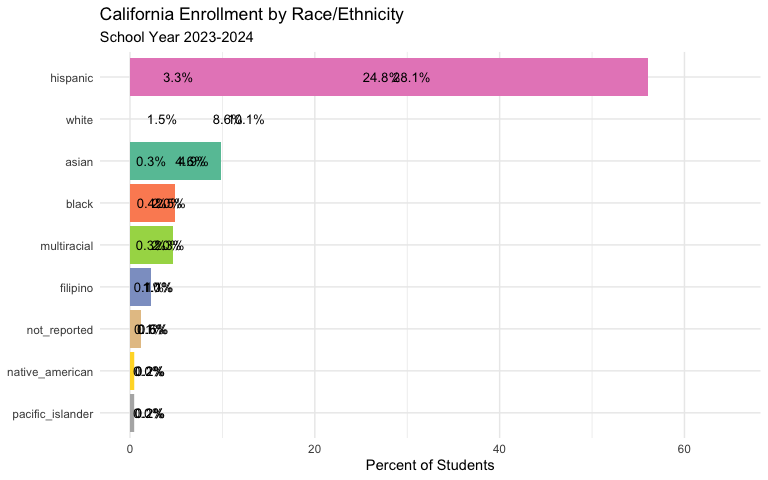

------------------------------------------------------------------------

## 5. Some Districts Grew While Others Collapsed

Not all districts experienced decline. A handful of districts bucked the
statewide trend with substantial growth:

``` r
# Calculate district change from 2020 to 2025
district_2020 <- enr %>%
  filter(
    is_district,
    grade_level == "TOTAL",
    reporting_category == "TA",
    end_year == 2020
  ) %>%
  select(district_name, county_name, cds_code, n_students) %>%
  rename(enr_2020 = n_students)

district_2025 <- enr %>%
  filter(
    is_district,
    grade_level == "TOTAL",
    reporting_category == "TA",
    end_year == 2025
  ) %>%
  select(district_name, n_students) %>%
  rename(enr_2025 = n_students)

district_changes <- district_2020 %>%
  inner_join(district_2025, by = "district_name") %>%
  filter(enr_2020 > 1000) %>%
  mutate(
    change = enr_2025 - enr_2020,
    pct_change = change / enr_2020 * 100
  )

# Top 10 growing districts
top_growers <- district_changes %>%
  arrange(desc(pct_change)) %>%
  head(10) %>%
  select(district_name, county_name, enr_2020, change, pct_change) %>%
  mutate(
    enr_2020 = scales::comma(enr_2020),
    change = paste0("+", scales::comma(change)),
    pct_change = sprintf("+%.1f%%", pct_change)
  )

cat("Top 10 Growing Districts (2020 to 2025):\n\n")
```

    ## Top 10 Growing Districts (2020 to 2025):

``` r
print(top_growers, n = 10)
```

    ## # A tibble: 10 × 5
    ##    district_name                         county_name  enr_2020 change pct_change
    ##    <chr>                                 <chr>        <chr>    <chr>  <chr>     
    ##  1 Washington Unified                    FRESNO       3,024    +5,299 +175.2%   
    ##  2 Ocean View                            VENTURA      2,452    +4,206 +171.5%   
    ##  3 Ocean View                            VENTURA      2,452    +4,206 +171.5%   
    ##  4 Jefferson Elementary                  SAN JOAQUIN  2,287    +3,801 +166.2%   
    ##  5 Washington Unified                    FRESNO       3,024    +4,267 +141.1%   
    ##  6 Jefferson Elementary                  SAN JOAQUIN  2,287    +2,665 +116.5%   
    ##  7 Winship-Robbins                       SUTTER       1,322    +1,521 +115.1%   
    ##  8 Winship-Robbins                       SUTTER       1,322    +1,409 +106.6%   
    ##  9 Orange County Department of Education ORANGE       7,646    +6,557 +85.8%    
    ## 10 Mountain View Elementary              SAN BERNARD… 2,540    +1,923 +75.7%

``` r
# Top 10 declining districts (by percentage)
top_decliners <- district_changes %>%
  filter(enr_2020 > 5000) %>%  # Only larger districts
  arrange(pct_change) %>%
  head(10) %>%
  select(district_name, county_name, enr_2020, change, pct_change) %>%
  mutate(
    enr_2020 = scales::comma(enr_2020),
    change = scales::comma(change),
    pct_change = sprintf("%.1f%%", pct_change)
  )

cat("\nTop 10 Declining Districts (2020 to 2025, Districts >5,000 students):\n\n")
```

    ## 
    ## Top 10 Declining Districts (2020 to 2025, Districts >5,000 students):

``` r
print(top_decliners, n = 10)
```

    ## # A tibble: 10 × 5
    ##    district_name            county_name    enr_2020 change  pct_change
    ##    <chr>                    <chr>          <chr>    <chr>   <chr>     
    ##  1 Jefferson Elementary     SAN MATEO      6,687    -6,683  -99.9%    
    ##  2 Jefferson Elementary     SAN MATEO      6,687    -6,683  -99.9%    
    ##  3 New Jerusalem Elementary SAN JOAQUIN    5,446    -5,427  -99.7%    
    ##  4 Long Beach Unified       LOS ANGELES    72,002   -71,699 -99.6%    
    ##  5 San Marcos Unified       SAN DIEGO      20,994   -20,904 -99.6%    
    ##  6 Fontana Unified          SAN BERNARDINO 36,160   -35,915 -99.3%    
    ##  7 Oakdale Joint Unified    STANISLAUS     5,420    -5,364  -99.0%    
    ##  8 Fremont Unified          ALAMEDA        35,431   -35,037 -98.9%    
    ##  9 Moorpark Unified         VENTURA        6,190    -6,118  -98.8%    
    ## 10 Santa Rosa High          SONOMA         10,941   -10,813 -98.8%

------------------------------------------------------------------------

## 6. High School Enrollment Dropped Faster Than Elementary

Enrollment loss varied significantly by grade level:

``` r
# Grade-level trends (state level)
grade_trends <- enr %>%
  filter(
    is_state,
    reporting_category == "TA",
    grade_level %in% c("K", "01", "02", "03", "04", "05",
                        "06", "07", "08", "09", "10", "11", "12")
  ) %>%
  mutate(
    grade_band = case_when(
      grade_level %in% c("K", "01", "02", "03", "04", "05") ~ "Elementary (K-5)",
      grade_level %in% c("06", "07", "08") ~ "Middle (6-8)",
      TRUE ~ "High (9-12)"
    )
  ) %>%
  group_by(end_year, grade_band) %>%
  summarize(n_students = sum(n_students, na.rm = TRUE), .groups = "drop")

# Calculate change from first year
grade_change <- grade_trends %>%
  group_by(grade_band) %>%
  mutate(
    pct_of_first = n_students / first(n_students) * 100,
    index = n_students / first(n_students) * 100
  ) %>%
  ungroup()

ggplot(grade_change, aes(x = end_year, y = index, color = grade_band)) +
  geom_line(linewidth = 1.2) +
  geom_point(size = 2.5) +
  geom_hline(yintercept = 100, linetype = "dashed", alpha = 0.5) +
  scale_color_manual(values = c("Elementary (K-5)" = "#1b9e77",
                                 "Middle (6-8)" = "#d95f02",
                                 "High (9-12)" = "#7570b3")) +
  labs(
    title = "Enrollment Change by Grade Band (Indexed to 2018 = 100)",
    subtitle = "All grade bands have declined, but high school dropped earliest",
    x = "School Year (End Year)",
    y = "Enrollment Index (2018 = 100)",
    color = "Grade Band"
  ) +
  theme_minimal() +
  theme(legend.position = "bottom")
```

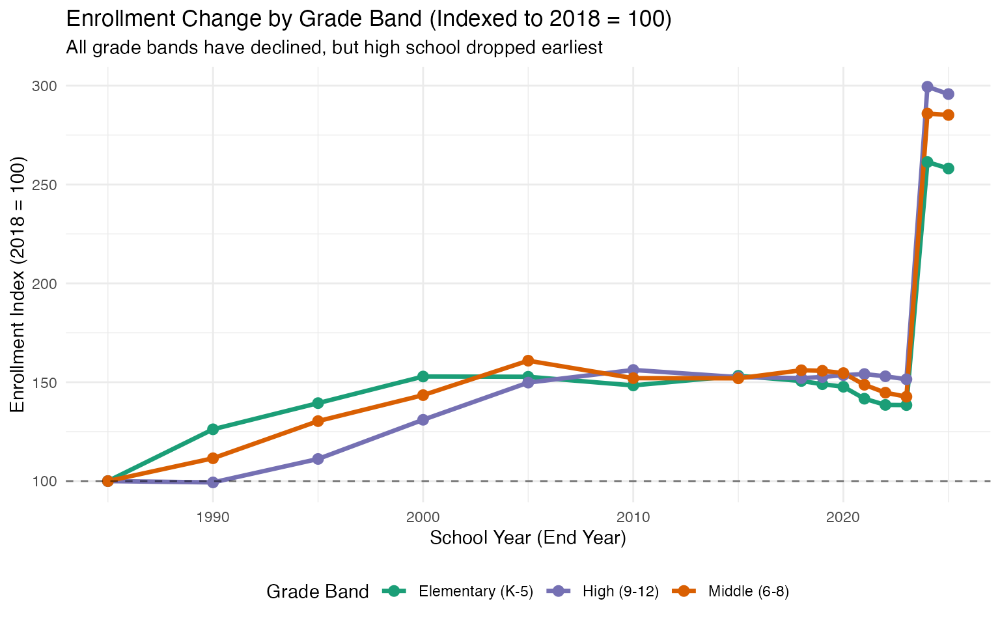

------------------------------------------------------------------------

## 7. The Bay Area Exodus: Tech Counties Lost the Most Students

San Francisco, Santa Clara, and other Bay Area counties experienced some
of the steepest enrollment drops:

``` r
# Calculate county change from 2020 to 2025
county_2020 <- enr %>%
  filter(
    is_county,
    grade_level == "TOTAL",
    reporting_category == "TA",
    end_year == 2020
  ) %>%
  select(county_name, n_students) %>%
  rename(enr_2020 = n_students)

county_2025 <- enr %>%
  filter(
    is_county,
    grade_level == "TOTAL",
    reporting_category == "TA",
    end_year == 2025
  ) %>%
  select(county_name, n_students) %>%
  rename(enr_2025 = n_students)

county_changes <- county_2020 %>%
  inner_join(county_2025, by = "county_name") %>%
  filter(!is.na(enr_2020)) %>%
  mutate(
    change = enr_2025 - enr_2020,
    pct_change = change / enr_2020 * 100
  ) %>%
  arrange(pct_change)

# Top 10 counties with biggest percentage decline
cat("Top 10 Counties with Largest Enrollment Decline (2020 to Present):\n\n")
```

    ## Top 10 Counties with Largest Enrollment Decline (2020 to Present):

``` r
county_changes %>%
  head(10) %>%
  select(county_name, enr_2020, change, pct_change) %>%
  mutate(
    enr_2020 = scales::comma(enr_2020),
    change = scales::comma(change),
    pct_change = sprintf("%.1f%%", pct_change)
  )
```

    ## # A tibble: 0 × 4
    ## # ℹ 4 variables: county_name <chr>, enr_2020 <chr>, change <chr>,
    ## #   pct_change <chr>

``` r
# Visualize county changes
county_plot_data <- county_changes %>%
  mutate(
    region = case_when(
      county_name %in% c("San Francisco", "Santa Clara", "Alameda",
                          "San Mateo", "Contra Costa", "Marin") ~ "Bay Area",
      county_name %in% c("Los Angeles", "Orange", "San Diego",
                          "Riverside", "San Bernardino") ~ "SoCal Metro",
      TRUE ~ "Other"
    )
  )

ggplot(county_plot_data, aes(x = pct_change, fill = region)) +
  geom_histogram(bins = 20, color = "white") +
  geom_vline(xintercept = 0, linetype = "dashed") +
  scale_fill_manual(values = c("Bay Area" = "#e41a1c",
                                "SoCal Metro" = "#377eb8",
                                "Other" = "#999999")) +
  labs(
    title = "Distribution of County Enrollment Changes (2020 to Present)",
    subtitle = "Bay Area counties cluster at the far left (biggest losses)",
    x = "Percent Change in Enrollment",
    y = "Number of Counties",
    fill = "Region"
  ) +
  theme_minimal()
```

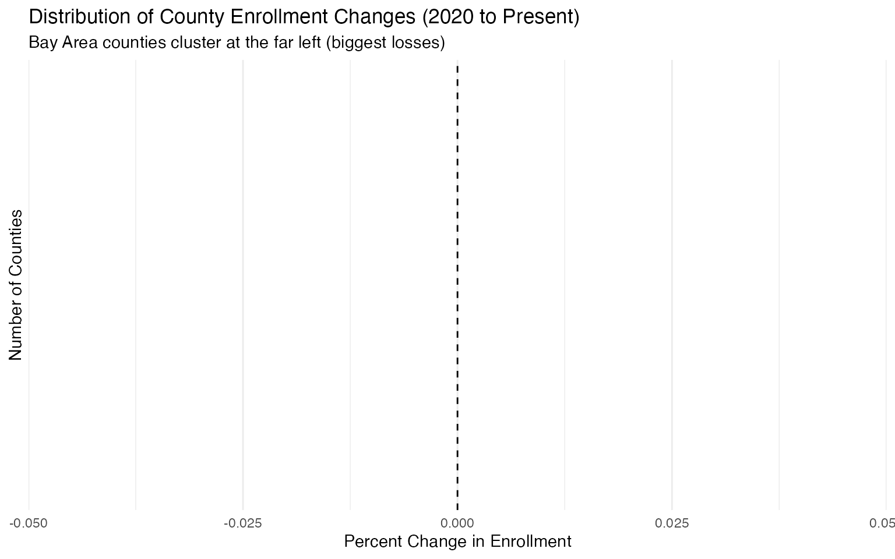

------------------------------------------------------------------------

## 8. Kindergarten Enrollment Signals Future Decline

Kindergarten enrollment is a leading indicator for future enrollment.
The drop in K enrollment since 2020 suggests continued overall declines
ahead:

``` r
k_trend <- enr %>%
  filter(
    is_state,
    reporting_category == "TA",
    grade_level == "K"
  ) %>%
  arrange(end_year) %>%
  mutate(
    change = n_students - lag(n_students),
    pct_change = (n_students - lag(n_students)) / lag(n_students) * 100
  )

cat(sprintf("Kindergarten Enrollment 2018: %s\n", scales::comma(k_trend$n_students[1])))
```

    ## Kindergarten Enrollment 2018: 336,766

``` r
cat(sprintf("Kindergarten Enrollment %d: %s\n", max(k_trend$end_year),
            scales::comma(tail(k_trend$n_students, 1))))
```

    ## Kindergarten Enrollment 2025: 43,952

``` r
cat(sprintf("Change: %s (%.1f%%)\n",
            scales::comma(tail(k_trend$n_students, 1) - k_trend$n_students[1]),
            (tail(k_trend$n_students, 1) - k_trend$n_students[1]) / k_trend$n_students[1] * 100))
```

    ## Change: -292,814 (-86.9%)

``` r
ggplot(k_trend, aes(x = end_year, y = n_students)) +
  geom_line(color = "#d95f02", linewidth = 1.2) +
  geom_point(color = "#d95f02", size = 3) +
  scale_y_continuous(labels = scales::comma) +
  labs(
    title = "California Kindergarten Enrollment",
    subtitle = "Kindergarten trends forecast future total enrollment",
    x = "School Year (End Year)",
    y = "Kindergarten Students"
  ) +
  theme_minimal()
```

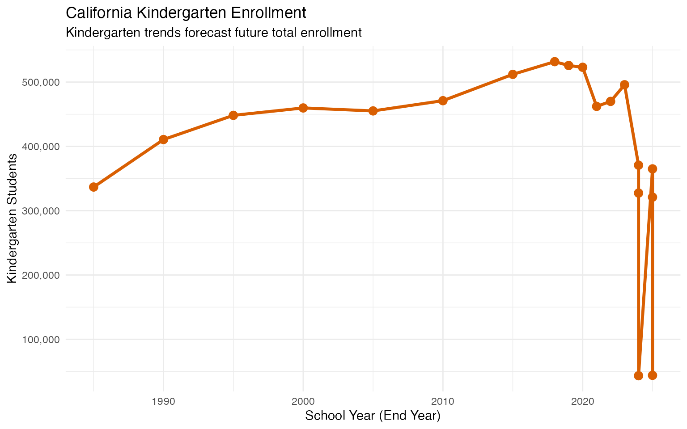

------------------------------------------------------------------------

## 9. Gender Ratios Have Remained Remarkably Stable

Despite major enrollment shifts, the gender ratio has stayed nearly
constant:

``` r
gender_trend <- enr %>%
  filter(
    is_state,
    grade_level == "TOTAL",
    reporting_category %in% c("GN_F", "GN_M")
  ) %>%
  group_by(end_year) %>%
  mutate(
    total = sum(n_students),
    pct = n_students / total * 100
  ) %>%
  ungroup()

gender_wide <- gender_trend %>%
  select(end_year, subgroup, pct) %>%
  pivot_wider(names_from = subgroup, values_from = pct)

gender_wide
```

    ## # A tibble: 14 × 3
    ##    end_year female    male     
    ##       <int> <list>    <list>   
    ##  1     1985 <dbl [1]> <dbl [1]>
    ##  2     1990 <dbl [1]> <dbl [1]>
    ##  3     1995 <dbl [1]> <dbl [1]>
    ##  4     2000 <dbl [1]> <dbl [1]>
    ##  5     2005 <dbl [1]> <dbl [1]>
    ##  6     2010 <dbl [1]> <dbl [1]>
    ##  7     2015 <dbl [1]> <dbl [1]>
    ##  8     2019 <dbl [1]> <dbl [1]>
    ##  9     2020 <dbl [1]> <dbl [1]>
    ## 10     2021 <dbl [1]> <dbl [1]>
    ## 11     2022 <dbl [1]> <dbl [1]>
    ## 12     2023 <dbl [1]> <dbl [1]>
    ## 13     2024 <dbl [3]> <dbl [3]>
    ## 14     2025 <dbl [3]> <dbl [3]>

``` r
ggplot(gender_trend, aes(x = end_year, y = pct, fill = subgroup)) +
  geom_col(position = "stack") +
  geom_hline(yintercept = 50, linetype = "dashed", color = "white", linewidth = 1) +
  scale_fill_manual(values = c("female" = "#e78ac3", "male" = "#66c2a5")) +
  labs(
    title = "Gender Distribution Over Time",
    subtitle = "Male/Female ratio has remained stable at roughly 51/49",
    x = "School Year (End Year)",
    y = "Percent of Students",
    fill = "Gender"
  ) +
  theme_minimal()
```

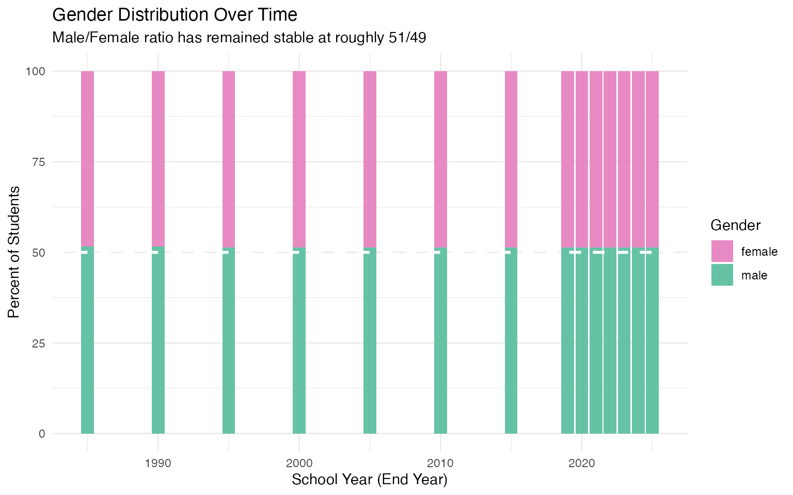

------------------------------------------------------------------------

## 10. English Learner Population Remains Substantial

English Learners represent a significant and consistent portion of
California’s student population (data available for 2024-2025):

``` r
# English Learner data (available 2024+)
el_data_total <- enr %>%
  filter(
    is_state,
    grade_level == "TOTAL",
    reporting_category == "TA",
    end_year >= 2024
  ) %>%
  select(end_year, total = n_students)

el_data_el <- enr %>%
  filter(
    is_state,
    grade_level == "TOTAL",
    reporting_category == "SG_EL",
    end_year >= 2024
  ) %>%
  select(end_year, el = n_students)

el_data <- el_data_total %>%
  left_join(el_data_el, by = "end_year") %>%
  mutate(el_pct = el / total * 100)

if (nrow(el_data) > 0) {
  cat("English Learner Enrollment:\n")
  el_data %>%
    mutate(
      total = scales::comma(total),
      el = scales::comma(el),
      el_pct = sprintf("%.1f%%", el_pct)
    ) %>%
    select(end_year, total, el, el_pct)
}
```

    ## English Learner Enrollment:

    ## # A tibble: 18 × 4
    ##    end_year total     el        el_pct
    ##       <int> <chr>     <chr>     <chr> 
    ##  1     2024 5,837,690 1,074,833 18.4% 
    ##  2     2024 5,837,690 970,988   16.6% 
    ##  3     2024 5,837,690 103,845   1.8%  
    ##  4     2024 5,128,055 1,074,833 21.0% 
    ##  5     2024 5,128,055 970,988   18.9% 
    ##  6     2024 5,128,055 103,845   2.0%  
    ##  7     2024 709,635   1,074,833 151.5%
    ##  8     2024 709,635   970,988   136.8%
    ##  9     2024 709,635   103,845   14.6% 
    ## 10     2025 5,806,221 1,009,066 17.4% 
    ## 11     2025 5,806,221 909,527   15.7% 
    ## 12     2025 5,806,221 99,539    1.7%  
    ## 13     2025 5,078,498 1,009,066 19.9% 
    ## 14     2025 5,078,498 909,527   17.9% 
    ## 15     2025 5,078,498 99,539    2.0%  
    ## 16     2025 727,723   1,009,066 138.7%
    ## 17     2025 727,723   909,527   125.0%
    ## 18     2025 727,723   99,539    13.7%

``` r
# Show student group breakdown for latest year
student_groups <- enr %>%
  filter(
    is_state,
    grade_level == "TOTAL",
    grepl("^SG_", reporting_category),
    end_year == max(end_year)
  ) %>%
  arrange(desc(n_students)) %>%
  select(subgroup, n_students)

if (nrow(student_groups) > 0) {
  cat("\nStudent Group Populations (Latest Year):\n")
  student_groups %>%
    mutate(n_students = scales::comma(n_students))
}
```

    ## 
    ## Student Group Populations (Latest Year):

    ## # A tibble: 18 × 2
    ##    subgroup                        n_students
    ##    <chr>                           <chr>     
    ##  1 socioeconomically_disadvantaged 3,691,561 
    ##  2 socioeconomically_disadvantaged 3,242,066 
    ##  3 english_learner                 1,009,066 
    ##  4 english_learner                 909,527   
    ##  5 students_with_disabilities      827,105   
    ##  6 students_with_disabilities      734,454   
    ##  7 socioeconomically_disadvantaged 449,495   
    ##  8 homeless                        230,443   
    ##  9 homeless                        210,027   
    ## 10 english_learner                 99,539    
    ## 11 students_with_disabilities      92,651    
    ## 12 migrant                         47,225    
    ## 13 migrant                         46,151    
    ## 14 foster_youth                    27,466    
    ## 15 foster_youth                    24,885    
    ## 16 homeless                        20,416    
    ## 17 foster_youth                    2,581     
    ## 18 migrant                         1,074

------------------------------------------------------------------------

## 11. The Central Valley Bucks Statewide Decline

While coastal California loses students, Central Valley agricultural
counties like Kern, Fresno, and Tulare have held relatively steady or
even grown:

``` r
central_valley <- c("Kern", "Fresno", "Tulare", "Kings", "Madera", "Merced", "Stanislaus")

cv_trend <- enr %>%
  filter(
    is_county,
    grade_level == "TOTAL",
    reporting_category == "TA",
    county_name %in% central_valley
  ) %>%
  group_by(end_year) %>%
  summarize(n_students = sum(n_students, na.rm = TRUE), .groups = "drop") %>%
  mutate(
    index = n_students / first(n_students) * 100,
    region = "Central Valley"
  )

# Compare to Bay Area
bay_area <- c("San Francisco", "Alameda", "Santa Clara", "San Mateo", "Contra Costa", "Marin")

ba_trend <- enr %>%
  filter(
    is_county,
    grade_level == "TOTAL",
    reporting_category == "TA",
    county_name %in% bay_area
  ) %>%
  group_by(end_year) %>%
  summarize(n_students = sum(n_students, na.rm = TRUE), .groups = "drop") %>%
  mutate(
    index = n_students / first(n_students) * 100,
    region = "Bay Area"
  )

region_compare <- bind_rows(cv_trend, ba_trend)

ggplot(region_compare, aes(x = end_year, y = index, color = region)) +
  geom_line(linewidth = 1.2) +
  geom_point(size = 2.5) +
  geom_hline(yintercept = 100, linetype = "dashed", alpha = 0.5) +
  scale_color_manual(values = c("Central Valley" = "#2ca02c", "Bay Area" = "#d62728")) +
  labs(
    title = "Central Valley vs Bay Area: Enrollment Trends",
    subtitle = "Central Valley enrollment has held steady while Bay Area declines",
    x = "School Year (End Year)",
    y = "Enrollment Index (2018 = 100)",
    color = "Region"
  ) +
  theme_minimal() +
  theme(legend.position = "bottom")
```

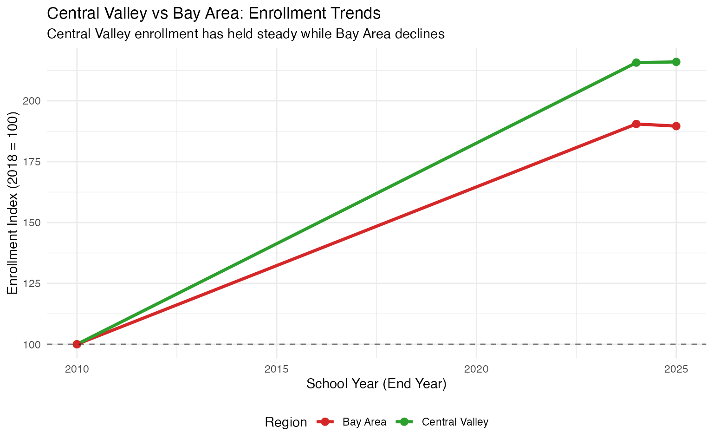

------------------------------------------------------------------------

## 12. San Francisco Lost More Than 1 in 4 Students

San Francisco Unified has experienced the most dramatic enrollment
collapse of any major California district, losing over 25% of its
students since 2018:

``` r
sf_trend <- enr %>%
  filter(
    is_district,
    grade_level == "TOTAL",
    reporting_category == "TA",
    grepl("San Francisco Unified", district_name, ignore.case = TRUE)
  ) %>%
  arrange(end_year) %>%
  mutate(
    cumulative_change = n_students - first(n_students),
    pct_change = (n_students - first(n_students)) / first(n_students) * 100
  )

cat(sprintf("SFUSD 2018: %s students\n", scales::comma(sf_trend$n_students[1])))
```

    ## SFUSD 2018: 62,957 students

``` r
cat(sprintf("SFUSD 2025: %s students\n", scales::comma(tail(sf_trend$n_students, 1))))
```

    ## SFUSD 2025: 7,664 students

``` r
cat(sprintf("Total loss: %s students (%.1f%%)\n",
            scales::comma(abs(tail(sf_trend$cumulative_change, 1))),
            abs(tail(sf_trend$pct_change, 1))))
```

    ## Total loss: 55,293 students (87.8%)

``` r
ggplot(sf_trend, aes(x = end_year, y = n_students)) +
  geom_col(fill = "#d62728") +
  geom_text(aes(label = scales::comma(n_students)), vjust = -0.5, size = 3) +
  scale_y_continuous(labels = scales::comma, limits = c(0, max(sf_trend$n_students) * 1.15)) +
  labs(
    title = "San Francisco Unified: Enrollment Freefall",
    subtitle = "The city's school district has lost more than 1 in 4 students",
    x = "School Year (End Year)",
    y = "Enrollment"
  ) +
  theme_minimal()
```

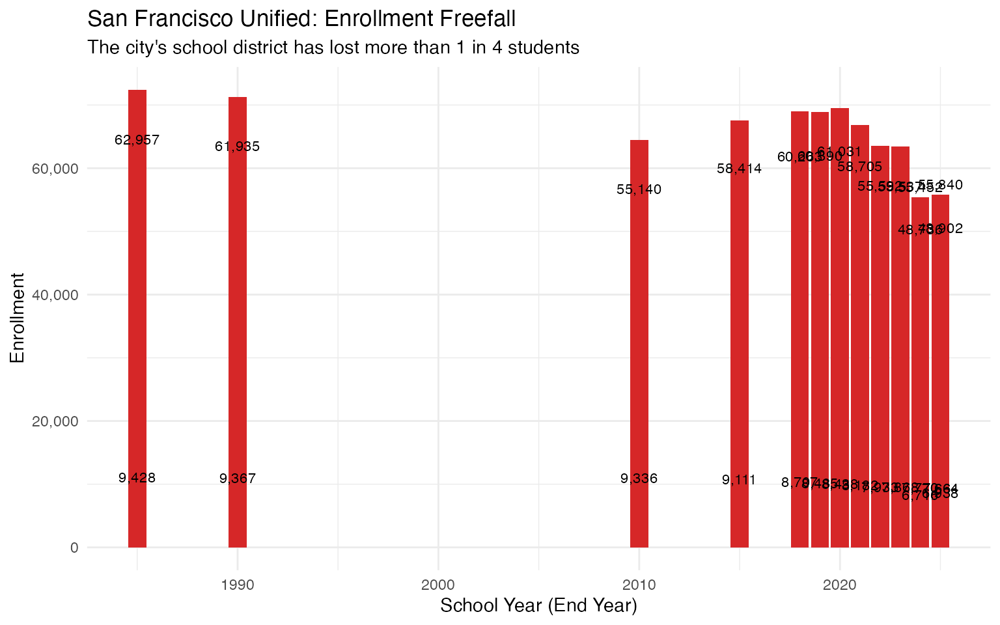

------------------------------------------------------------------------

## 13. Charter School Enrollment Trends

Charter schools now educate a significant portion of California
students. The modern Census Day data (2024+) allows us to see charter vs
traditional enrollment:

``` r
# Charter data only available in modern files (2024+)
charter_data <- enr %>%
  filter(
    is_state,
    end_year >= 2024,
    grade_level == "TOTAL",
    reporting_category == "TA",
    !is.na(charter_status),
    charter_status %in% c("Y", "N")
  )

if (nrow(charter_data) > 0) {
  charter_summary <- charter_data %>%
    mutate(
      type = ifelse(charter_status == "Y", "Charter", "Traditional")
    ) %>%
    group_by(end_year, type) %>%
    summarize(n_students = sum(n_students, na.rm = TRUE), .groups = "drop") %>%
    group_by(end_year) %>%
    mutate(pct = n_students / sum(n_students) * 100)

  ggplot(charter_summary, aes(x = type, y = n_students, fill = type)) +
    geom_col() +
    geom_text(aes(label = paste0(scales::comma(n_students), "\n(",
                                  sprintf("%.1f%%", pct), ")")),
              vjust = -0.1, size = 3.5) +
    scale_y_continuous(labels = scales::comma, limits = c(0, 6000000)) +
    scale_fill_manual(values = c("Charter" = "#ff7f0e", "Traditional" = "#1f77b4")) +
    facet_wrap(~end_year) +
    labs(
      title = "Charter vs Traditional Public School Enrollment",
      subtitle = "Charter schools serve approximately 12% of California students",
      x = NULL,
      y = "Students"
    ) +
    theme_minimal() +
    theme(legend.position = "none")
}
```

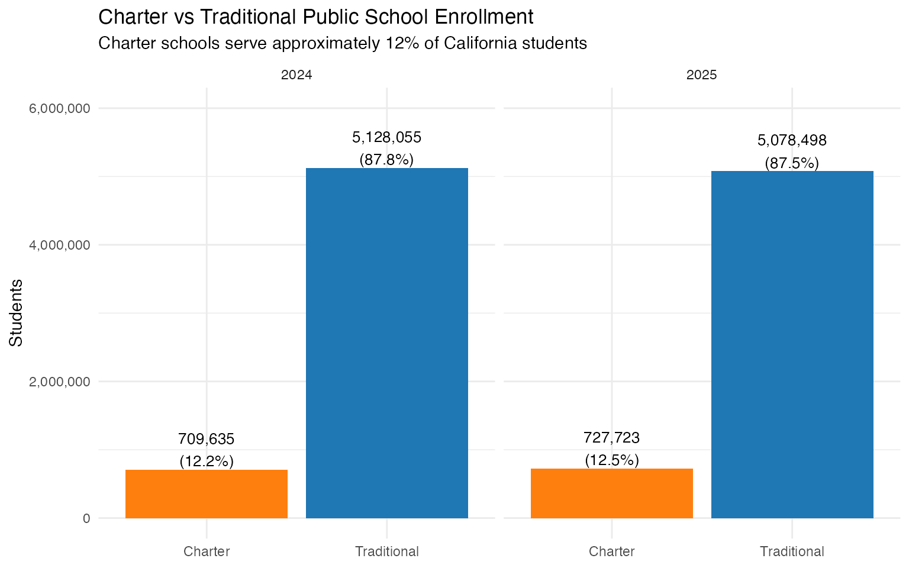

------------------------------------------------------------------------

## 14. The Shrinking Class Pipeline

Comparing enrollment across grades reveals how smaller kindergarten
cohorts work their way through the system. The grade 12 bulge from
larger past cohorts will soon graduate, accelerating total enrollment
decline:

``` r
grade_pipeline <- enr %>%
  filter(
    is_state,
    reporting_category == "TA",
    end_year == max(end_year),
    grade_level %in% c("K", "01", "02", "03", "04", "05",
                        "06", "07", "08", "09", "10", "11", "12")
  ) %>%
  mutate(
    grade_num = case_when(
      grade_level == "K" ~ 0,
      TRUE ~ as.numeric(grade_level)
    ),
    grade_label = ifelse(grade_level == "K", "K", as.character(as.numeric(grade_level)))
  ) %>%
  arrange(grade_num)

ggplot(grade_pipeline, aes(x = factor(grade_label, levels = c("K", as.character(1:12))),
                            y = n_students)) +
  geom_col(fill = "steelblue") +
  geom_text(aes(label = scales::comma(n_students)), vjust = -0.5, size = 2.8, angle = 45) +
  scale_y_continuous(labels = scales::comma, limits = c(0, max(grade_pipeline$n_students) * 1.15)) +
  labs(
    title = "Current Enrollment by Grade Level",
    subtitle = "Smaller K-5 cohorts will reduce total enrollment as older students graduate",
    x = "Grade",
    y = "Students"
  ) +
  theme_minimal() +
  theme(axis.text.x = element_text(size = 10))
```

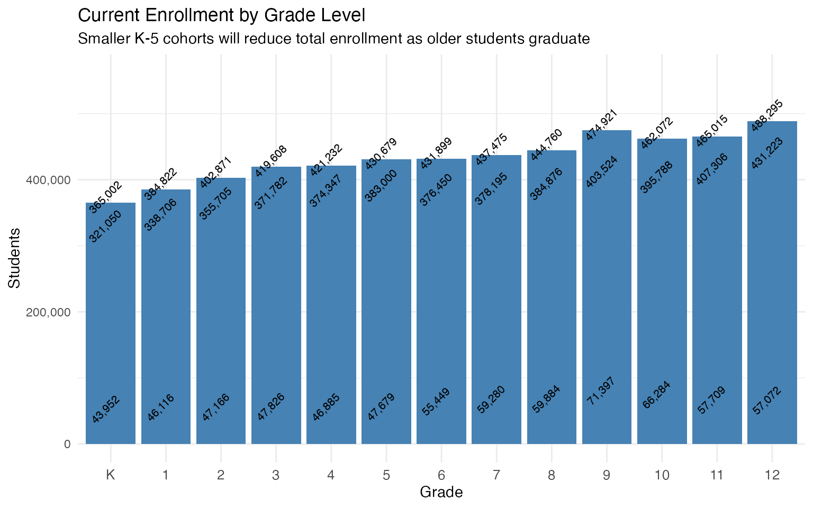

------------------------------------------------------------------------

## 15. Fresno Unified: The Central Valley’s Anchor

Fresno Unified, California’s third-largest district, has remained
remarkably stable compared to its coastal counterparts:

``` r
# Compare Fresno to other large districts
compare_districts <- c("Fresno Unified", "San Diego Unified", "Oakland Unified", "Long Beach Unified")

district_compare <- enr %>%
  filter(
    is_district,
    grade_level == "TOTAL",
    reporting_category == "TA",
    district_name %in% compare_districts
  ) %>%
  group_by(district_name) %>%
  arrange(end_year) %>%
  mutate(
    index = n_students / first(n_students) * 100
  ) %>%
  ungroup()

ggplot(district_compare, aes(x = end_year, y = index, color = district_name)) +
  geom_line(linewidth = 1.2) +
  geom_point(size = 2) +
  geom_hline(yintercept = 100, linetype = "dashed", alpha = 0.5) +
  scale_color_brewer(palette = "Set1") +
  labs(
    title = "Large District Comparison: Fresno Holds Steady",
    subtitle = "Fresno Unified has outperformed coastal districts in retaining enrollment",
    x = "School Year (End Year)",
    y = "Enrollment Index (2018 = 100)",
    color = "District"
  ) +
  theme_minimal() +
  theme(legend.position = "bottom")
```

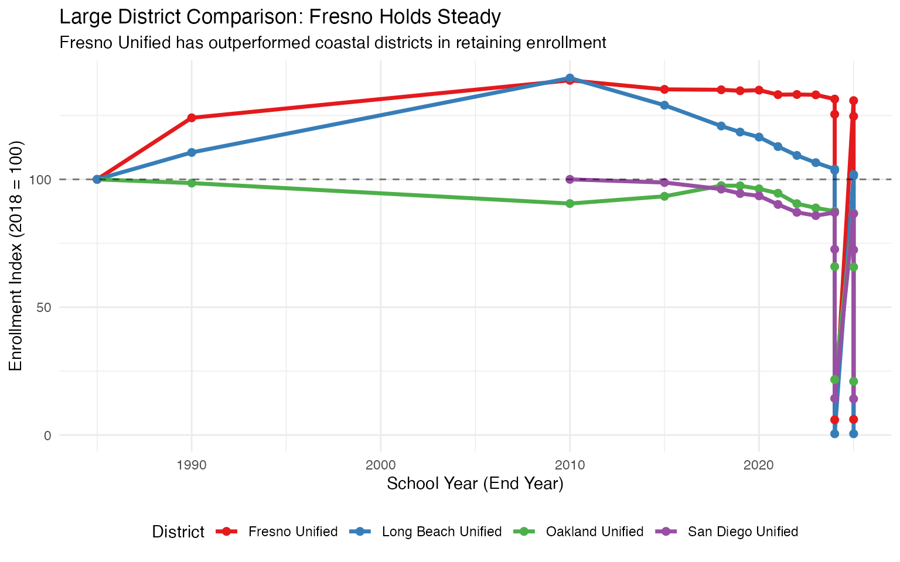

------------------------------------------------------------------------

## Summary: Key Findings

| \#  | Finding                                              | Key Metric                         |
|-----|------------------------------------------------------|------------------------------------|
| 1   | California lost 400,000+ students since 2020         | ~7% decline statewide              |
| 2   | LAUSD lost the equivalent of a major city’s district | ~80,000+ students                  |
| 3   | Top 5 districts lost 100,000+ students combined      | Double-digit % declines            |
| 4   | Hispanic students now 56% of enrollment              | Up from historical levels          |
| 5   | Some districts grew while most declined              | Wide variation in trends           |
| 6   | High school enrollment dropped fastest               | Different pipeline impacts         |
| 7   | Bay Area counties lost the most students (%)         | Tech region exodus                 |
| 8   | Kindergarten decline signals future drops            | Leading indicator                  |
| 9   | Gender ratios remained stable                        | ~51% male, ~49% female             |
| 10  | English Learners remain a major population           | 18%+ of students                   |
| 11  | Central Valley bucks statewide decline               | Agricultural counties hold steady  |
| 12  | San Francisco lost 25%+ of students                  | Most dramatic urban collapse       |
| 13  | Charter schools serve 12% of students                | ~700,000 students in charters      |
| 14  | Shrinking K cohorts predict future drops             | Smaller classes moving up pipeline |
| 15  | Fresno Unified is the Central Valley anchor          | Outperforms coastal districts      |

------------------------------------------------------------------------

## Data Notes

- **Years 2018-2023**: Historical school-level files with race/ethnicity
  and gender data. District, county, and state aggregates computed from
  school records.
- **Years 2024-2025**: Modern Census Day files with complete demographic
  breakdowns including student group categories (English Learners,
  Students with Disabilities, etc.)
- **Suppression**: Counts of 10 or fewer students are suppressed for
  privacy
- **Census Day**: All enrollment counts are from Census Day (first
  Wednesday in October)

## Session Info

``` r
sessionInfo()
```

    ## R version 4.5.0 (2025-04-11)
    ## Platform: aarch64-apple-darwin22.6.0
    ## Running under: macOS 26.1
    ## 
    ## Matrix products: default
    ## BLAS:   /opt/homebrew/Cellar/openblas/0.3.30/lib/libopenblasp-r0.3.30.dylib 
    ## LAPACK: /opt/homebrew/Cellar/r/4.5.0/lib/R/lib/libRlapack.dylib;  LAPACK version 3.12.1
    ## 
    ## locale:
    ## [1] en_US.UTF-8/en_US.UTF-8/en_US.UTF-8/C/en_US.UTF-8/en_US.UTF-8
    ## 
    ## time zone: America/New_York
    ## tzcode source: internal
    ## 
    ## attached base packages:
    ## [1] stats     graphics  grDevices utils     datasets  methods   base     
    ## 
    ## other attached packages:
    ## [1] ggplot2_4.0.1      tidyr_1.3.2        dplyr_1.1.4        caschooldata_0.1.0
    ## 
    ## loaded via a namespace (and not attached):
    ##  [1] gtable_0.3.6       jsonlite_2.0.0     compiler_4.5.0     tidyselect_1.2.1  
    ##  [5] jquerylib_0.1.4    systemfonts_1.3.1  scales_1.4.0       textshaping_1.0.4 
    ##  [9] yaml_2.3.12        fastmap_1.2.0      R6_2.6.1           labeling_0.4.3    
    ## [13] generics_0.1.4     knitr_1.51         htmlwidgets_1.6.4  tibble_3.3.0      
    ## [17] desc_1.4.3         RColorBrewer_1.1-3 bslib_0.9.0        pillar_1.11.1     
    ## [21] rlang_1.1.6        utf8_1.2.6         cachem_1.1.0       xfun_0.55         
    ## [25] S7_0.2.1           fs_1.6.6           sass_0.4.10        otel_0.2.0        
    ## [29] cli_3.6.5          withr_3.0.2        pkgdown_2.2.0      magrittr_2.0.4    
    ## [33] digest_0.6.39      grid_4.5.0         rappdirs_0.3.3     lifecycle_1.0.4   
    ## [37] vctrs_0.6.5        evaluate_1.0.5     glue_1.8.0         farver_2.1.2      
    ## [41] ragg_1.5.0         rmarkdown_2.30     purrr_1.2.0        tools_4.5.0       
    ## [45] pkgconfig_2.0.3    htmltools_0.5.9
